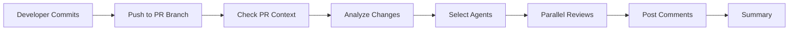

# Automated Agent Review System

## Overview

The **Automated Agent Review System** provides proactive, intelligent code review feedback immediately after commits are pushed to pull requests. Custom agents automatically analyze changes based on their expertise areas and post actionable feedback directly in PR comments.

> **🎯 Key Benefit:** Get instant, expert feedback on every commit without manual review requests - your code is continuously reviewed by specialized agents as you work.

## ⚡ Quick Start

**For Developers:**
1. Create a PR with your changes
2. Commit and push your code
3. Agents automatically review within 2-3 minutes
4. Check PR comments for feedback
5. Address issues and commit again - agents re-review automatically!

**For First-Time Users:**
- No setup required - works automatically on all PRs
- Agents select themselves based on what you changed
- Read agent comments for actionable improvement suggestions
- Tag agents with `@agent-name` if you have questions

## 🎯 Goals

1. **Proactive Feedback**: Get immediate review comments after each commit
2. **Expertise-Based Review**: Route changes to agents with relevant domain knowledge
3. **Actionable Insights**: Receive specific, actionable suggestions for improvement
4. **Continuous Improvement**: Reviews run automatically on every commit
5. **Agent Collaboration**: Multiple agents can review different aspects of the same PR

## 🚀 How It Works

### Trigger Flow



### Agent Selection Logic

Agents are selected based on:

1. **File Patterns**: Which files were changed
2. **Relevance Score**: How many relevant files each agent covers
3. **Top 3 Rule**: Maximum of 3 agents review per commit (highest scores)

**Example:**
- Changed `aithercore/security/certificates.psm1` → **Sarah Security** (score: 3)
- Changed `automation-scripts/0150_Setup-VM.ps1` → **Maya Infrastructure** (score: 3)
- Changed `tests/unit/Security.Tests.ps1` → **Jessica Testing** (score: 3)
- All `.ps1` files → **Rachel PowerShell** (score: 2 per file)

## 📋 Agent Expertise Areas

| Agent | Icon | Reviews |
|-------|------|---------|
| **Maya Infrastructure** | 🏗️ | Infrastructure code, VM management, networking, OpenTofu/Terraform |
| **Sarah Security** | 🔒 | Security code, certificates, credentials, sensitive data handling |
| **Jessica Testing** | 🧪 | Test files, test coverage, quality validation |
| **Emma Frontend** | 🎨 | UI/UX components, menus, console interfaces |
| **Marcus Backend** | ⚙️ | PowerShell modules, APIs, backend logic |
| **Olivia Documentation** | 📚 | Markdown files, documentation, READMEs |
| **Rachel PowerShell** | ⚡ | PowerShell scripts, best practices, cross-platform code |
| **David ProjectManager** | 📋 | Workflows, planning documents, project coordination |

## 🔍 Review Checks

### Common Checks (All Agents)

- **PSScriptAnalyzer**: Warnings and errors in PowerShell code
- **Syntax Validation**: Valid PowerShell syntax
- **File Structure**: Proper organization and naming

### Agent-Specific Checks

#### Rachel PowerShell (⚡)
- ✅ Use of `Write-CustomLog` instead of `Write-Host`
- ✅ `#Requires -Version 7.0` directive present
- ✅ Approved PowerShell verbs
- ✅ Cross-platform compatibility (`$IsWindows`, `$IsLinux`, `$IsMacOS`)

#### Sarah Security (🔒)
- 🔒 No plaintext passwords or secrets in code
- 🔒 Proper use of `ConvertTo-SecureString`
- 🔒 Sensitive data not in environment variables
- 🔒 Certificate handling best practices

#### Jessica Testing (🧪)
- 🧪 Tests exist for new automation scripts
- 🧪 Pester test structure follows conventions
- 🧪 Test coverage for critical paths
- 🧪 Proper use of mocking and assertions

#### Olivia Documentation (📚)
- 📚 Comment-based help (`.SYNOPSIS`, `.DESCRIPTION`)
- 📚 No broken links in markdown
- 📚 Proper formatting and structure
- 📚 Complete parameter documentation

#### Maya Infrastructure (🏗️)
- 🏗️ Infrastructure as Code best practices
- 🏗️ VM configuration validation
- 🏗️ Network security considerations

#### Emma Frontend (🎨)
- 🎨 Consistent UI patterns
- 🎨 Accessibility considerations
- 🎨 User experience improvements

#### Marcus Backend (⚙️)
- ⚙️ Module structure and exports
- ⚙️ API design patterns
- ⚙️ Performance considerations

#### David ProjectManager (📋)
- 📋 Workflow configuration correctness
- 📋 Process alignment
- 📋 Resource planning

## 📊 Review Output Format

### Issue Severity Levels

1. **🚨 Critical Issues** (Errors)
   - Must be fixed before merge
   - Break functionality or security
   - Block PR approval

2. **⚠️ Warnings**
   - Should be fixed
   - Potential problems
   - Code quality concerns

3. **💡 Suggestions** (Information)
   - Nice to have improvements
   - Best practice recommendations
   - Code optimization opportunities

### Comment Structure

```markdown
## 🤖 Automated Review: Agent Name

**Commit:** `abc1234` • **Files Reviewed:** 5 • **Issues Found:** 3

**Focus Area:** Agent expertise description

---

### 🚨 Critical Issues (1)
- **`path/to/file.ps1`** (Line 42)
  - Issue description
  - Rule: `RuleName`

### ⚠️ Warnings (1)
- **`path/to/file.ps1`** (Line 15)
  - Warning description
  - Rule: `RuleName`

### 💡 Suggestions (1)
- **`path/to/file.ps1`** (Line 8)
  - Suggestion description
  - Rule: `RuleName`

---

### 📋 Next Steps
1. Review the issues identified above
2. Address critical issues and warnings
3. Consider the suggestions for improvements
4. Re-commit - review runs automatically

**Need help?** Tag me with `@agent-id` for guidance.

---
*🤖 Automated review by Agent Name • Powered by AitherZero*
```

## 🎬 Usage Examples

### Example 1: Security Code Change

**Scenario:** You commit changes to `aithercore/security/Certificate-Management.psm1`

**Result:**
- 🔒 **Sarah Security** reviews the changes
- Checks for secure credential handling
- Validates certificate operations
- Ensures no sensitive data exposure
- Posts detailed feedback with line numbers

**Sample Feedback:**
```markdown
## 🔒 Automated Review: Sarah Security

⚠️ Warning: Avoid using -AsPlainText with ConvertTo-SecureString
- Line 85 in Certificate-Management.psm1
- Use secure credential storage instead

💡 Suggestion: Add certificate validation before operations
- Consider adding certificate expiry checks
```

### Example 2: New Automation Script

**Scenario:** You add `automation-scripts/0425_Validate-Infrastructure.ps1`

**Result:**
- ⚡ **Rachel PowerShell** reviews PowerShell practices
- 🧪 **Jessica Testing** checks for test coverage
- 📚 **Olivia Documentation** validates documentation

**Sample Feedback:**
```markdown
## ⚡ Automated Review: Rachel PowerShell
✅ No issues found! Code follows PowerShell best practices.

## 🧪 Automated Review: Jessica Testing
💡 Suggestion: Add tests for this script
- Run: ./automation-scripts/0950_Generate-AllTests.ps1

## 📚 Automated Review: Olivia Documentation
💡 Suggestion: Add comment-based help
- Include .SYNOPSIS, .DESCRIPTION, .EXAMPLE
```

### Example 3: Workflow Changes

**Scenario:** You modify `.github/workflows/quality-validation.yml`

**Result:**
- 📋 **David ProjectManager** reviews workflow structure
- ⚡ **Rachel PowerShell** validates PowerShell steps
- Checks for best practices
- Validates permissions and triggers

## 🔧 Configuration

### Workflow File

Location: `.github/workflows/automated-agent-review.yml`

### Key Features

- **Automatic Trigger**: Runs on every push to PR branches
- **PR Detection**: Automatically finds associated PRs
- **Parallel Execution**: Multiple agents review simultaneously
- **Smart Filtering**: Only relevant agents review
- **Incremental Reviews**: Reviews only changed files in each commit

### Customization

To customize agent checks, edit the review logic in the workflow's "Perform Automated Review" step for each agent.

## 💡 Best Practices

### For Developers

1. **Read All Feedback**: Review all agent comments, not just critical issues
2. **Address Issues Incrementally**: Fix issues in focused commits
3. **Ask Questions**: Tag agents (`@agent-id`) for clarification
4. **Learn from Patterns**: Notice recurring suggestions
5. **Run Local Checks**: Use `./automation-scripts/0404_Run-PSScriptAnalyzer.ps1` before committing

### For Maintainers

1. **Monitor Review Quality**: Ensure agents provide valuable feedback
2. **Tune Agent Logic**: Adjust scoring and file patterns as needed
3. **Add Custom Rules**: Extend agent-specific checks
4. **Update Documentation**: Keep agent expertise areas current
5. **Review False Positives**: Improve detection accuracy

## 🔗 Integration with Existing Systems

### Works With

- ✅ **Copilot Agent Router** (`.github/workflows/copilot-agent-router.yml`)
  - Suggests agents when PR opens
  - Automated review provides continuous feedback

- ✅ **Quality Validation** (`.github/workflows/quality-validation.yml`)
  - Complements quality checks
  - Focuses on actionable feedback vs. pass/fail

- ✅ **PR Validation** (`.github/workflows/pr-validation.yml`)
  - Runs alongside syntax validation
  - Provides deeper code review

### Coordination

- **No Duplicate Comments**: Checks for existing comments before posting
- **Unique Perspective**: Each agent focuses on their expertise
- **Summary Comment**: Final summary links all agent reviews

## 📈 Metrics and Monitoring

### Workflow Metrics

Monitor in GitHub Actions:
- Number of agents triggered per commit
- Review completion time
- Issue counts by severity
- Agent coverage per PR

### Review Quality

Track effectiveness:
- Issues addressed vs. ignored
- Time to fix critical issues
- Developer feedback on usefulness
- False positive rate

## 🛠️ Troubleshooting

### Issue: No agents review my changes

**Cause**: Changed files don't match any agent patterns

**Solution**: 
- Check `.github/copilot.yaml` for file patterns
- Verify file paths in your commit
- Consider if generic agents (Rachel, Marcus) should cover

### Issue: Too many issues reported

**Cause**: Code has quality issues or agent rules are too strict

**Solution**:
- Run `./automation-scripts/0404_Run-PSScriptAnalyzer.ps1` locally first
- Address issues incrementally
- Adjust agent sensitivity if needed (edit workflow)

### Issue: Agent suggestions don't apply

**Cause**: False positive or context-specific exception

**Solution**:
- Document why suggestion doesn't apply (in code comment)
- Report false positive to maintainers
- Consider suppressing specific rules

### Issue: Review doesn't trigger

**Cause**: Not pushing to a PR branch or PR is draft

**Solution**:
- Ensure branch has an open PR
- Mark PR as "Ready for review" if draft
- Check workflow permissions

## 🔮 Future Enhancements

Planned improvements:

1. **AI-Powered Reviews**: Integrate with LLM for deeper analysis
2. **Learning System**: Agents learn from accepted/rejected suggestions
3. **Custom Agent Rules**: Per-repo customization of checks
4. **Review Discussions**: Thread-based discussions on specific issues
5. **Automated Fixes**: Suggest or apply fixes automatically
6. **Review History**: Track patterns and trends over time

## 📚 Related Documentation

- [Agent Routing Guide](./AGENT-ROUTING-GUIDE.md) - Manual agent invocation
- [Custom Agents README](./agents/README.md) - Agent profiles and expertise
- [Copilot Configuration](./copilot.yaml) - Agent configuration file
- [Quality Validation](../QUALITY-VALIDATION.md) - Quality standards

## 🤝 Contributing

To improve the automated review system:

1. **Add Agent Checks**: Extend agent-specific logic in workflow
2. **Improve Detection**: Enhance file pattern matching
3. **Custom Rules**: Add domain-specific validation rules
4. **Documentation**: Update this guide with examples
5. **Feedback**: Report issues and suggestions

## 📄 License

Part of the AitherZero project - see main repository LICENSE.

---

**Version:** 1.0  
**Last Updated:** November 2024  
**Maintained by:** AitherZero Team

*🤖 Making code reviews proactive, intelligent, and actionable*
