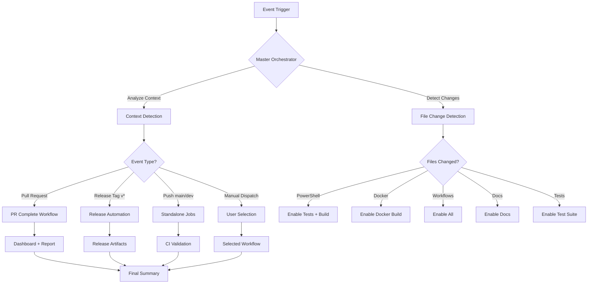
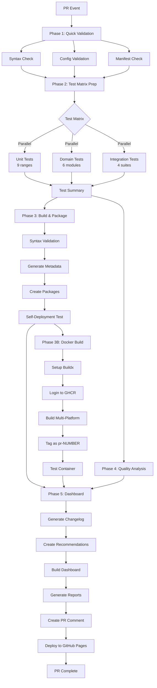
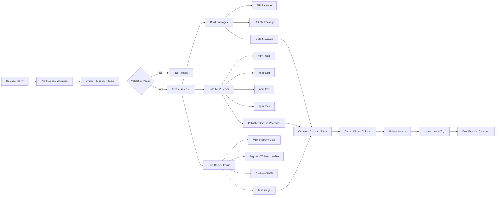
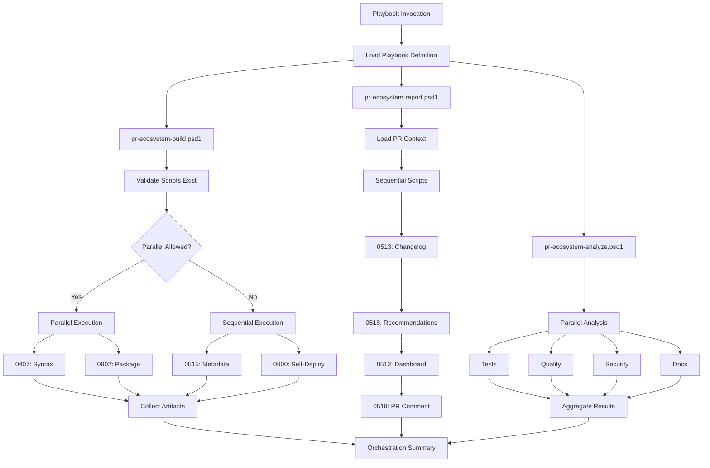
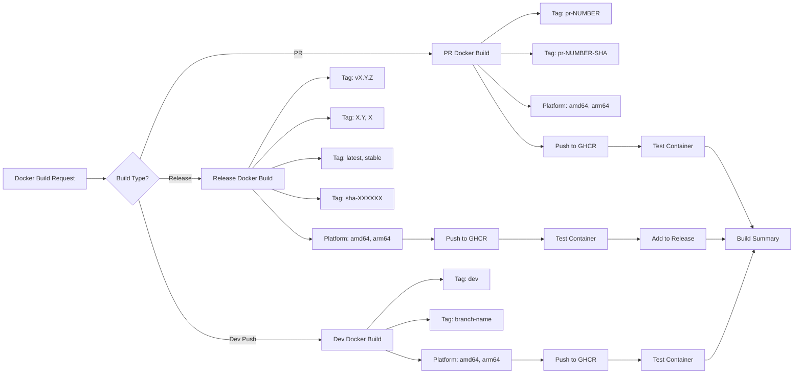
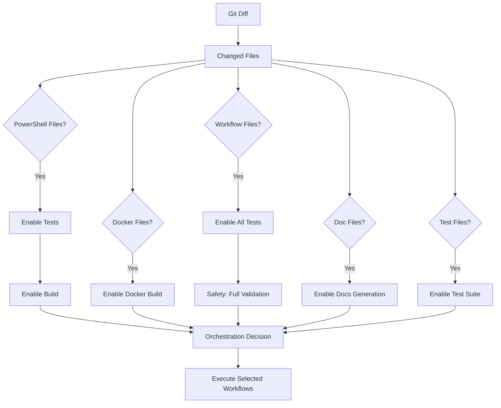
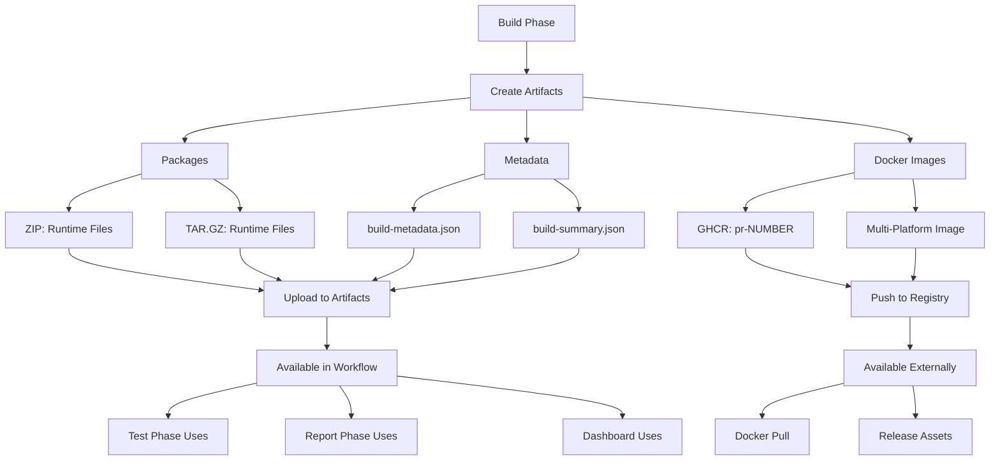

# Workflow Architecture Diagram

## Master Orchestrator Flow

## PR Complete Workflow (Enhanced with Docker)

## Release Workflow

## Playbook Execution Flow

## Docker Build Pipeline

## File Change Detection Logic

## Artifact Flow

## Legend

### Shapes
- **Rectangle:** Process/Job
- **Diamond:** Decision Point
- **Parallelogram:** Input/Output
- **Circle:** Start/End

### Colors (in actual Mermaid rendering)
- **Blue:** Primary workflow steps
- **Green:** Success paths
- **Orange:** Parallel execution
- **Red:** Error/Failure paths

---

**Note:** These diagrams use Mermaid syntax and will render properly in:
- GitHub (automatically)
- VS Code (with Mermaid extension)
- Most modern markdown viewers

To view these diagrams:
1. Open this file in GitHub (renders automatically)
2. Use VS Code with Mermaid Preview extension
3. Use online tools like https://mermaid.live
