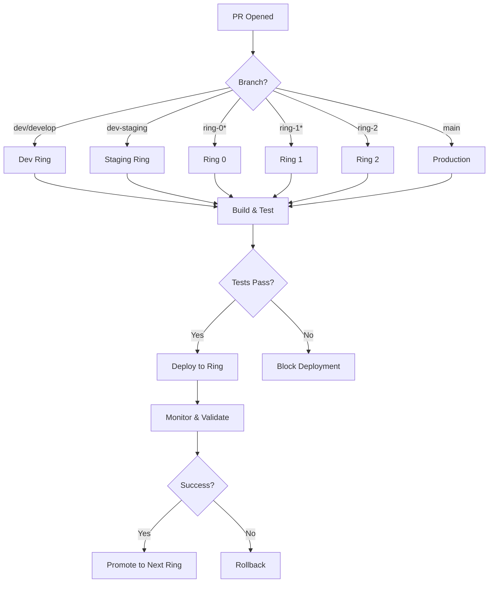

# 🎭 Deployment Rings Strategy Guide

## Overview

AitherZero implements a progressive deployment strategy using deployment rings to safely roll out changes across environments. Each branch maps to a specific deployment ring, ensuring controlled and validated releases.

## Deployment Ring Hierarchy

### Ring Architecture

```
Ring 0 (Canary) → Ring 1 (Early Adopters) → Ring 2 (Broader Testing) → Production
     ↓                      ↓                        ↓                      ↓
  ring-0              ring-1                    ring-2                   main
  ring-0-integrations ring-1-integrations                                
```

### Ring Definitions

#### Ring 0: Canary / Inner Ring
- **Branches**: `ring-0`, `ring-0-integrations`
- **Purpose**: Initial validation with smallest user base
- **Deployment**: Automatic on PR merge
- **Duration**: 24-48 hours
- **Validation**: Automated tests + manual smoke tests
- **Rollback**: Immediate if issues detected

**Characteristics:**
- Highest risk tolerance
- Fastest deployment cycle
- Most comprehensive monitoring
- Limited user exposure
- Quick rollback capability

#### Ring 1: Early Adopters
- **Branches**: `ring-1`, `ring-1-integrations`
- **Purpose**: Broader validation with engaged users
- **Deployment**: After Ring 0 success (24-48h soak)
- **Duration**: 3-5 days
- **Validation**: Ring 0 success + performance metrics
- **Rollback**: Fast track available

**Characteristics:**
- Moderate risk tolerance
- Controlled expansion
- Enhanced monitoring
- User feedback collection
- Performance validation

#### Ring 2: Broader Testing
- **Branches**: `ring-2`
- **Purpose**: Pre-production validation
- **Deployment**: After Ring 1 success
- **Duration**: 5-7 days  
- **Validation**: Ring 1 success + load testing
- **Rollback**: Planned process

**Characteristics:**
- Lower risk tolerance
- Near-production scale
- Comprehensive testing
- Final validation gate
- Production simulation

#### Production
- **Branches**: `main`
- **Purpose**: Production releases
- **Deployment**: After Ring 2 success
- **Duration**: Indefinite
- **Validation**: All rings successful
- **Rollback**: Emergency only

**Characteristics:**
- Zero risk tolerance
- Full user base
- Maximum stability
- Complete monitoring
- Strict change control

### Development Branches

#### Staging
- **Branch**: `dev-staging`
- **Purpose**: Pre-ring validation
- **Deployment**: Continuous from dev
- **Validation**: Integration tests
- **Gateway**: To Ring 0

#### Development
- **Branches**: `dev`, `develop`
- **Purpose**: Active development
- **Deployment**: Continuous
- **Validation**: Unit tests + basic integration
- **Gateway**: To dev-staging

## Docker Image Tagging Strategy

### Tag Formats

Each deployment gets multiple tags for flexibility:

```bash
# Primary tag (versioned)
pr-{number}-{branch}-v{iteration}

# Branch-latest tag
pr-{number}-{branch}-latest

# PR-latest tag
pr-{number}-latest

# Commit-specific tag
pr-{number}-{commit-sha}

# Ring-specific tag (NEW!)
{ring}-pr-{number}-latest
```

### Examples by Branch

#### Ring 0 PR #123
```bash
ghcr.io/wizzense/aitherzero:pr-123-ring-0-v42
ghcr.io/wizzense/aitherzero:pr-123-ring-0-latest
ghcr.io/wizzense/aitherzero:ring-0-pr-123-latest
ghcr.io/wizzense/aitherzero:pr-123-latest
ghcr.io/wizzense/aitherzero:pr-123-a1b2c3d4
```

#### Dev-Staging PR #456
```bash
ghcr.io/wizzense/aitherzero:pr-456-dev-staging-v15
ghcr.io/wizzense/aitherzero:pr-456-dev-staging-latest
ghcr.io/wizzense/aitherzero:staging-pr-456-latest
ghcr.io/wizzense/aitherzero:pr-456-latest
ghcr.io/wizzense/aitherzero:pr-456-5e6f7a8b
```

#### Production Release v1.5.0
```bash
ghcr.io/wizzense/aitherzero:1.5.0
ghcr.io/wizzense/aitherzero:latest
ghcr.io/wizzense/aitherzero:stable
ghcr.io/wizzense/aitherzero:sha-9c8d7e6f
```

## Container Labels & Metadata

All images include comprehensive metadata:

```yaml
labels:
  # OCI Standard Labels
  org.opencontainers.image.title: "AitherZero"
  org.opencontainers.image.version: "1.5.0"
  org.opencontainers.image.source: "https://github.com/wizzense/AitherZero"
  
  # AitherZero Custom Labels
  com.aitherzero.deployment.ring: "ring-0"        # Deployment ring
  com.aitherzero.branch.name: "ring-0"            # Source branch
  com.aitherzero.pr.number: "123"                 # PR number
  com.aitherzero.build.iteration: "42"            # Build version
  com.aitherzero.build.timestamp: "20250111-154530" # Build time
```

### Querying by Ring

```bash
# List all Ring 0 images
docker images ghcr.io/wizzense/aitherzero --filter "label=com.aitherzero.deployment.ring=ring-0"

# Find images by PR number
docker images ghcr.io/wizzense/aitherzero --filter "label=com.aitherzero.pr.number=123"

# Get ring information from running container
docker inspect aitherzero-pr-123 --format '{{index .Config.Labels "com.aitherzero.deployment.ring"}}'
```

## Deployment Workflows

### PR-Based Deployment Flow



### Promotion Criteria

#### Dev → Staging
- ✅ All unit tests pass
- ✅ Integration tests pass
- ✅ No critical issues

#### Staging → Ring 0
- ✅ Staging validation successful
- ✅ Performance benchmarks met
- ✅ Manual approval

#### Ring 0 → Ring 1
- ✅ 24-48h soak successful
- ✅ No critical incidents
- ✅ Monitoring metrics green
- ✅ Automated tests pass

#### Ring 1 → Ring 2
- ✅ 3-5 day validation successful
- ✅ User feedback positive
- ✅ Performance acceptable
- ✅ No regressions detected

#### Ring 2 → Production
- ✅ 5-7 day validation successful
- ✅ Load testing passed
- ✅ All quality gates met
- ✅ Change review board approval

## Container Deployment

### Per-PR Deployment

Each PR gets an isolated environment:

```bash
# PR #123 from ring-0 branch
docker pull ghcr.io/wizzense/aitherzero:ring-0-pr-123-latest
docker run -d \
  --name aitherzero-pr-123 \
  -p 8123:8080 \
  -e DEPLOYMENT_RING=ring-0 \
  -e PR_NUMBER=123 \
  ghcr.io/wizzense/aitherzero:ring-0-pr-123-latest
```

### Ring-Specific Deployment

```bash
# Deploy latest Ring 0 version
docker pull ghcr.io/wizzense/aitherzero:ring-0-pr-123-latest
docker run -d --name aitherzero-ring0 \
  -p 8080:8080 \
  -e DEPLOYMENT_RING=ring-0 \
  ghcr.io/wizzense/aitherzero:ring-0-pr-123-latest

# Deploy to Ring 1 (after Ring 0 success)
docker pull ghcr.io/wizzense/aitherzero:ring-1-pr-124-latest  
docker run -d --name aitherzero-ring1 \
  -p 8081:8080 \
  -e DEPLOYMENT_RING=ring-1 \
  ghcr.io/wizzense/aitherzero:ring-1-pr-124-latest
```

## Monitoring & Validation

### Health Checks

Each deployment includes:
- Container health checks (30s interval)
- PowerShell module load validation
- API endpoint checks (if applicable)
- Smoke tests post-deployment

### Success Criteria by Ring

#### Ring 0
- Container starts successfully
- Module loads without errors
- Basic smoke tests pass
- No critical errors in 24h

#### Ring 1
- Ring 0 criteria met
- Performance within 10% of baseline
- User error rate <1%
- No P0 incidents

#### Ring 2
- Ring 1 criteria met
- Load testing successful
- Regression tests pass
- Monitoring metrics green

#### Production
- Ring 2 criteria met
- Change review approved
- Rollback plan validated
- On-call team briefed

## Rollback Procedures

### Automated Rollback

Triggers:
- Critical errors detected
- Health checks failing
- Container crashes
- Test failures

Process:
```bash
# Stop failed deployment
docker stop aitherzero-pr-123

# Rollback to previous version
docker tag ghcr.io/wizzense/aitherzero:ring-0-pr-122-latest \
           ghcr.io/wizzense/aitherzero:ring-0-latest
docker restart aitherzero-ring0
```

### Manual Rollback

```bash
# Identify last known good version
docker images ghcr.io/wizzense/aitherzero:ring-0-* --format "table {{.Tag}}\t{{.CreatedAt}}"

# Deploy previous version
docker run -d --name aitherzero-ring0-rollback \
  ghcr.io/wizzense/aitherzero:ring-0-pr-122-latest
  
# Switch traffic
docker stop aitherzero-ring0
docker rename aitherzero-ring0-rollback aitherzero-ring0
```

## Best Practices

### For Developers

1. **Always test in dev first**
   - Never skip development environment
   - Validate locally before pushing

2. **Use staging for integration**
   - Test with realistic data
   - Validate external dependencies

3. **Monitor ring deployments**
   - Watch metrics after promotion
   - Be ready to rollback

4. **Respect soak times**
   - Allow full validation period
   - Don't rush to production

### For Operations

1. **Automate validation**
   - Use automated health checks
   - Monitor key metrics

2. **Document changes**
   - Track what changed
   - Note validation results

3. **Maintain rollback capability**
   - Keep previous versions available
   - Test rollback procedures

4. **Communicate status**
   - Update stakeholders
   - Report incidents promptly

## Troubleshooting

### Deployment Stuck in Ring

**Symptom**: Deployment not progressing to next ring

**Check**:
```bash
# Review deployment status
docker inspect aitherzero-ring0 --format '{{.State.Health.Status}}'

# Check logs
docker logs aitherzero-ring0 --tail 100

# Verify metrics
curl http://localhost:8080/health
```

**Resolution**:
- Review validation criteria
- Check monitoring dashboards
- Investigate any errors
- Consider manual override if appropriate

### Image Tag Not Found

**Symptom**: Docker pull fails for expected tag

**Check**:
```bash
# List available tags
gh api /orgs/wizzense/packages/container/aitherzero/versions \
  --jq '.[] | .metadata.container.tags[]' | grep ring-0

# Verify workflow ran
gh run list --workflow=04-deploy-pr-environment.yml
```

**Resolution**:
- Check workflow execution logs
- Verify build completed
- Confirm tag generation logic
- Retry deployment workflow

## Reference

- **Workflow**: `.github/workflows/04-deploy-pr-environment.yml`
- **Docker Registry**: `ghcr.io/wizzense/aitherzero`
- **Monitoring**: Ring-specific dashboards on GitHub Pages
- **Documentation**: This guide + workflow inline comments

---

**Last Updated**: 2025-11-11  
**Maintained By**: Infrastructure Team (Maya)  
**Version**: 1.0.0
