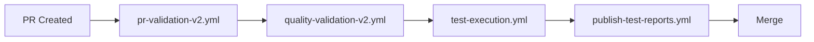
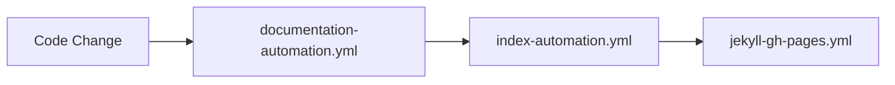

# GitHub Actions Workflows

This directory contains 18 optimized GitHub Actions workflows for AitherZero CI/CD automation.

## Quick Reference

### 🧪 Testing & Quality (6 workflows)

- **`test-execution.yml`** ⭐ NEW - Complete test suite (unit/domain/integration) with parallel execution
- **`publish-test-reports.yml`** - Publish test results to GitHub Pages
- **`pr-validation-v2.yml`** - PR validation (quick + comprehensive modes)
- **`quality-validation-v2.yml`** - Code quality checks (PSScriptAnalyzer, AST validation)
- **`ci-cd-sequences-v2.yml`** - Orchestration sequences and health monitoring
- **`release-automation.yml`** - Release management and automation

### 📚 Documentation (2 workflows)

- **`documentation-automation.yml`** - Auto-generate, track, and archive documentation
- **`index-automation.yml`** - Project index automation

### 🤖 Intelligent Automation (5 workflows)

- **`phase2-intelligent-issue-creation.yml`** - Smart issue creation from failures
- **`copilot-agent-router.yml`** - Route work to specialized AI agents
- **`automated-agent-review.yml`** - AI-powered code reviews
- **`diagnose-ci-failures.yml`** - Diagnose and report CI failures
- **`comment-release.yml`** - Comment-triggered workflow execution

### 🏗️ Infrastructure (3 workflows)

- **`deploy-pr-environment.yml`** - Deploy ephemeral PR test environments
- **`validate-config.yml`** - Validate config.psd1 manifest
- **`validate-manifests.yml`** - Validate PowerShell module manifests

### 📊 Publishing (2 workflows)

- **`jekyll-gh-pages.yml`** - Deploy documentation to GitHub Pages
- **`ring-status-dashboard.yml`** - Generate ring branching status dashboard

---

## Workflow Categories

### Core CI/CD Pipeline



**Triggers**: Pull request events, push to main/develop

1. **PR Validation** (`pr-validation-v2.yml`)
   - Fast syntax and basic checks
   - Runs on all PRs automatically
   - Supports quick and comprehensive modes

2. **Quality Validation** (`quality-validation-v2.yml`)
   - PSScriptAnalyzer checks
   - AST validation
   - Code quality metrics

3. **Test Execution** (`test-execution.yml`) ⭐ NEW
   - Unit tests (automation scripts by range)
   - Domain tests (module functionality)
   - Integration tests (E2E workflows)
   - Parallel matrix execution (up to 19 concurrent jobs)
   - Configurable modes: all, unit, domain, integration, quick

4. **Test Reports** (`publish-test-reports.yml`)
   - Publishes results to GitHub Pages
   - Generates dashboards and summaries

### Intelligent Automation

**Purpose**: AI-powered automation and issue management

1. **Agent Router** (`copilot-agent-router.yml`)
   - Analyzes PR changes
   - Routes to specialized agents (testing, infrastructure, security, etc.)

2. **Agent Review** (`automated-agent-review.yml`)
   - Proactive code review by AI agents
   - Provides contextual feedback

3. **Issue Creation** (`phase2-intelligent-issue-creation.yml`)
   - Creates issues from test failures
   - Intelligent deduplication
   - Rich context and agent routing

4. **CI Diagnostics** (`diagnose-ci-failures.yml`)
   - Analyzes workflow failures
   - Provides diagnostic reports

### Documentation Pipeline



1. **Documentation Automation** (`documentation-automation.yml`)
   - Auto-generates function documentation
   - Tracks documentation freshness
   - Archives to GitHub Pages

2. **Index Automation** (`index-automation.yml`)
   - Updates index.md files
   - Maintains project structure documentation

3. **GitHub Pages** (`jekyll-gh-pages.yml`)
   - Deploys documentation site
   - Publishes test reports and dashboards

---

## Usage Examples

### Running Tests

**Automatic** (on PR or push):
```yaml
# test-execution.yml triggers automatically
# Runs appropriate test suite based on changes
```

**Manual** (workflow dispatch):
```bash
# Via GitHub UI: Actions → Test Execution → Run workflow
# Choose test suite: all, unit, domain, integration, quick
# Enable/disable coverage reporting
```

**Local Testing**:
```powershell
# Use the same playbooks that workflows use
Invoke-AitherPlaybook -Name test-orchestration
Invoke-AitherScript -Number 0402  # Unit tests
Invoke-AitherScript -Number 0403  # Integration tests
```

### PR Validation

**Quick validation** (automatic on PR):
```yaml
# pr-validation-v2.yml runs automatically
# Fast checks: syntax, basic validation
```

**Comprehensive validation** (manual):
```yaml
# Trigger via workflow_dispatch
# Runs extended validation suite
```

### Triggering Workflows Manually

```bash
# Via GitHub CLI
gh workflow run test-execution.yml -f test_suite=all -f coverage=true

# Via GitHub UI
# 1. Go to Actions tab
# 2. Select workflow from left sidebar
# 3. Click "Run workflow" button
# 4. Fill in parameters
# 5. Click "Run workflow"
```

---

## Consolidation History

**Date**: 2025-11-08  
**Previous Count**: 30 workflows  
**Current Count**: 18 workflows  
**Reduction**: 40%

### Disabled Workflows

The following workflows have been consolidated and disabled (`.disabled` extension):

**Testing** (4 workflows):
- `comprehensive-tests-v2.yml` → `test-execution.yml`
- `parallel-testing.yml` → `test-execution.yml`
- `auto-generate-tests.yml` → `test-execution.yml`
- `validate-test-sync.yml` → `test-execution.yml`

**PR Validation** (3 workflows):
- `pr-validation.yml` → `pr-validation-v2.yml`
- `quick-health-check-v2.yml` → `pr-validation-v2.yml`
- `quick-health-check.yml` → `pr-validation-v2.yml`

**Quality** (1 workflow):
- `quality-validation.yml` → `quality-validation-v2.yml`

**Documentation** (2 workflows):
- `documentation-tracking.yml` → `documentation-automation.yml`
- `archive-documentation.yml` → `documentation-automation.yml`

**Issue Creation** (1 workflow):
- `auto-create-issues-from-failures.yml` → `phase2-intelligent-issue-creation.yml`

**CI/CD** (1 workflow):
- `workflow-health-check.yml` → `ci-cd-sequences-v2.yml`

See [`CONSOLIDATION-GUIDE.md`](./CONSOLIDATION-GUIDE.md) for detailed migration information.

---

## Workflow Optimization Best Practices

### 1. Use Caching
Most workflows use GitHub Actions cache to speed up execution:
```yaml
- uses: actions/cache@v4
  with:
    path: |
      library/tests/results
      library/tests/coverage
    key: ${{ runner.os }}-test-results-${{ github.sha }}
```

### 2. Parallel Execution
`test-execution.yml` demonstrates optimal parallel matrix usage:
- 9 unit test ranges run concurrently
- 6 domain modules run concurrently
- 4 integration suites run concurrently
- Total: up to 19 concurrent jobs

### 3. Conditional Steps
Use `if` conditions to skip unnecessary work:
```yaml
- name: Step Name
  if: always() && github.event_name == 'pull_request'
```

### 4. Workflow Dispatch
Enable manual triggering with inputs:
```yaml
on:
  workflow_dispatch:
    inputs:
      test_suite:
        type: choice
        options: [all, unit, domain, integration, quick]
```

---

## Troubleshooting

### Workflow Not Triggering

**Check**:
1. File extension is `.yml` (not `.disabled`)
2. Workflow has valid YAML syntax
3. Trigger events are configured correctly
4. Branch patterns match your branch name

### Workflow Failing

**Steps**:
1. Check **`diagnose-ci-failures.yml`** - it auto-analyzes failures
2. Review workflow logs in Actions tab
3. Check for breaking changes in dependencies
4. Verify environment variables and secrets

### Need Help?

**Resources**:
- Workflow Logs: Actions → Select workflow run → View logs
- Diagnostics: `diagnose-ci-failures.yml` creates detailed reports
- Agent Help: `copilot-agent-router.yml` suggests appropriate agents
- Documentation: See individual workflow files for detailed comments

---

## Contributing

When adding or modifying workflows:

1. ✅ Check if existing workflow can be enhanced instead of creating new one
2. ✅ Follow naming convention: `purpose-description-version.yml`
3. ✅ Add comprehensive comments and documentation
4. ✅ Use workflow dispatch for manual triggering when appropriate
5. ✅ Implement proper error handling and reporting
6. ✅ Add to this README with clear description
7. ✅ Test locally when possible using same scripts/playbooks

**Prefer**: Enhancing existing workflows over creating new ones to avoid workflow sprawl.

---

## Monitoring & Maintenance

### Active Monitoring
- **Ring Status Dashboard** (`ring-status-dashboard.yml`) - Overall health
- **CI/CD Sequences** (`ci-cd-sequences-v2.yml`) - Workflow health checks
- **Diagnose Failures** (`diagnose-ci-failures.yml`) - Failure analysis

### Regular Maintenance
- Review disabled workflows quarterly (delete if no longer needed)
- Update workflow dependencies (actions/checkout, etc.)
- Monitor workflow execution times and optimize
- Review and consolidate as the project evolves

---

**Last Updated**: 2025-11-08  
**Total Active Workflows**: 18  
**Status**: Optimized ✅
