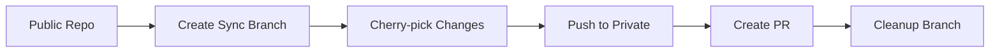
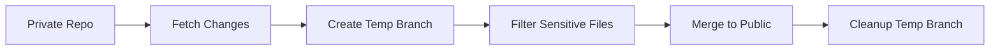

# RepoSync Module

## Test Status
- **Last Run**: 2025-07-08 18:50:21 UTC
- **Status**: ✅ PASSING (49/49 tests)
- **Coverage**: 0%
- **Platform**: ✅ Windows ✅ Linux ✅ macOS
- **Dependencies**: ✅ All resolved

## Test Results
| Test Suite | Status | Tests | Coverage | Duration |
|------------|--------|-------|----------|----------|
| Unit Tests | ✅ PASS | 49/49 | 0% | 3.5s |

---
*Test status updated automatically by AitherZero Testing Framework*
## Test Results
| Test Suite | Status | Tests | Coverage | Duration |
|------------|--------|-------|----------|----------|
| Unit Tests | ✅ PASS | 6/6 | 0% | 1.3s |

---
*Test status updated automatically by AitherZero Testing Framework*
## Test Results
| Test Suite | Status | Tests | Coverage | Duration |
|------------|--------|-------|----------|----------|
| Unit Tests | ❌ FAIL | 43/49 | 0% | 3.4s |

---
*Test status updated automatically by AitherZero Testing Framework*
## Test Results
| Test Suite | Status | Tests | Coverage | Duration |
|------------|--------|-------|----------|----------|
| Unit Tests | ✅ PASS | 11/11 | 0% | 1.4s |

---
*Test status updated automatically by AitherZero Testing Framework*
## Test Results
| Test Suite | Status | Tests | Coverage | Duration |
|------------|--------|-------|----------|----------|
| Unit Tests | ❌ FAIL | 43/49 | 0% | 3.6s |

---
*Test status updated automatically by AitherZero Testing Framework*
## Test Results
| Test Suite | Status | Tests | Coverage | Duration |
|------------|--------|-------|----------|----------|
| Unit Tests | ✅ PASS | 11/11 | 0% | 1.5s |

---
*Test status updated automatically by AitherZero Testing Framework*
## Test Results
| Test Suite | Status | Tests | Coverage | Duration |
|------------|--------|-------|----------|----------|
| Unit Tests | ✅ PASS | 10/10 | 0% | 1s |

---
*Test status updated automatically by AitherZero Testing Framework*
## Test Results
| Test Suite | Status | Tests | Coverage | Duration |
|------------|--------|-------|----------|----------|
| Unit Tests | ✅ PASS | 11/11 | 0% | 0.5s |

---
*Test status updated automatically by AitherZero Testing Framework*
## Test Results
| Test Suite | Status | Tests | Coverage | Duration |
|------------|--------|-------|----------|----------|
| Unit Tests | ✅ PASS | 11/11 | 0% | 1.5s |

---
*Test status updated automatically by AitherZero Testing Framework*
## Test Results
| Test Suite | Status | Tests | Coverage | Duration |
|------------|--------|-------|----------|----------|
| Unit Tests | ✅ PASS | 11/11 | 0% | 1.5s |

---
*Test status updated automatically by AitherZero Testing Framework*
## Test Results
| Test Suite | Status | Tests | Coverage | Duration |
|------------|--------|-------|----------|----------|
| Unit Tests | ✅ PASS | 11/11 | 0% | 1.5s |

---
*Test status updated automatically by AitherZero Testing Framework*
## Module Overview

The **RepoSync** module manages bidirectional synchronization between public AitherZero and private aitherlab repositories. It provides automated workflows for keeping repositories in sync while maintaining security boundaries and handling sensitive data exclusions.

### Core Functionality and Purpose

- **Bidirectional Synchronization**: Sync changes between public and private repositories
- **Selective Syncing**: Choose specific files or branches to synchronize
- **Security Filtering**: Automatically exclude sensitive files and configurations
- **Git Integration**: Seamless integration with Git workflows and GitHub CLI
- **PR Automation**: Automatic pull request creation for review workflows
- **Divergence Monitoring**: Track and report repository synchronization status

### Architecture and Design Patterns

The module implements a **sync strategy pattern** with separate handlers for different synchronization directions. It uses **filtering pipelines** to exclude sensitive content and employs **branch isolation** to prevent conflicts during sync operations.

### Key Features

- **Safe Sync Operations**: Branch-based operations with automatic cleanup
- **Sensitive Data Protection**: Configurable exclusion patterns for security
- **Automatic PR Creation**: GitHub CLI integration for pull request workflows
- **Dry Run Mode**: Preview changes before applying them
- **Status Monitoring**: Real-time sync status and divergence reporting
- **Error Recovery**: Robust error handling with automatic rollback

## Directory Structure

```
RepoSync/
├── RepoSync.psd1           # Module manifest
├── RepoSync.psm1           # Main module implementation
└── README.md               # This documentation
```

### Module Files and Organization

The RepoSync module is a focused utility module with all functionality contained in the main module file:

- **RepoSync.psd1**: Module manifest defining metadata and exported functions
- **RepoSync.psm1**: Core implementation with sync logic and Git operations
- No Public/Private separation as functions are tightly integrated for sync workflows

## Function Reference

### Sync-ToAitherLab

Synchronizes changes from the current (public) repository to the private aitherlab repository.

#### Parameters

| Parameter | Type | Required | Description |
|-----------|------|----------|-------------|
| CommitMessage | string | Yes | Message describing the changes being synced |
| BranchName | string | No | Name for the sync branch (auto-generated if not provided) |
| FilesToSync | string[] | No | Specific files to sync (syncs all if empty) |
| CreatePR | switch | No | Create a pull request after pushing |
| Force | switch | No | Override uncommitted changes warning |

#### Returns

- **void**: Logs sync progress and results

#### Examples

```powershell
# Basic sync to aitherlab
Sync-ToAitherLab -CommitMessage "Add new deployment features"

# Sync specific files only
Sync-ToAitherLab -CommitMessage "Update configuration files" `
    -FilesToSync @("config/app.json", "scripts/deploy.ps1")

# Sync with automatic PR creation
Sync-ToAitherLab -CommitMessage "Feature: Enhanced monitoring" `
    -CreatePR

# Custom branch name for sync
Sync-ToAitherLab -CommitMessage "Hotfix: Security patch" `
    -BranchName "sync/security-patch-$(Get-Date -Format 'yyyyMMdd')" `
    -CreatePR

# Force sync despite uncommitted changes
Sync-ToAitherLab -CommitMessage "Emergency sync" `
    -Force
```

### Sync-FromAitherLab

Synchronizes changes from the private aitherlab repository to the current repository.

#### Parameters

| Parameter | Type | Required | Description |
|-----------|------|----------|-------------|
| Branch | string | No | Source branch to sync from (default: "main") |
| ExcludeFiles | string[] | No | File patterns to exclude from sync |
| DryRun | switch | No | Preview changes without applying them |

#### Returns

- **void**: Logs sync progress and results

#### Examples

```powershell
# Basic sync from aitherlab
Sync-FromAitherLab

# Sync from specific branch
Sync-FromAitherLab -Branch "develop"

# Preview changes without applying
Sync-FromAitherLab -DryRun

# Sync with custom exclusions
Sync-FromAitherLab -ExcludeFiles @(
    "*.secret*",
    "private-configs/*",
    ".env.*",
    "internal-docs/*"
)

# Sync development branch excluding sensitive files
Sync-FromAitherLab -Branch "feature/new-capability" `
    -ExcludeFiles @("*.key", "secrets/*", "private/*")
```

### Get-SyncStatus

Displays comprehensive synchronization status between repositories.

#### Parameters

None.

#### Returns

- **void**: Displays formatted status information

#### Example

```powershell
# Check synchronization status
Get-SyncStatus
```

#### Sample Output

```
Repository Sync Status:
======================

Configured Remotes:
origin  https://github.com/AitherLabs/AitherZero.git (fetch)
origin  https://github.com/AitherLabs/AitherZero.git (push)
aitherlab   https://github.com/yourusername/aitherlab.git (fetch)
aitherlab   https://github.com/yourusername/aitherlab.git (push)

Divergence from aitherlab:
  Ahead:  5 commits
  Behind: 2 commits

Files different from aitherlab:
.github/workflows/ci.yml
src/modules/Security/SecurityModule.psm1
docs/deployment-guide.md
```

## Key Features

### Synchronization Patterns

#### Push-Based Sync (Sync-ToAitherLab)


#### Pull-Based Sync (Sync-FromAitherLab)


### Security Filtering

The module automatically excludes sensitive files during sync operations:

#### Default Exclusion Patterns
- `.github/workflows/*` - CI/CD configurations
- `*.secret*` - Files containing secrets
- `*.env*` - Environment files
- `private-*` - Files prefixed with "private"
- `internal-*` - Internal documentation
- `*.key` - Key files
- `*.pem` - Certificate files

#### Custom Exclusion Example
```powershell
# Define custom security filters
$sensitivePatterns = @(
    "config/production/*",
    "scripts/internal/*",
    "*.credential*",
    "backup-keys/*",
    "vendor-specific/*"
)

Sync-FromAitherLab -ExcludeFiles $sensitivePatterns
```

### Branch Management

#### Automatic Branch Naming
```powershell
# Default branch naming pattern
$branchName = "sync/aitherzero-$(Get-Date -Format 'yyyyMMdd-HHmmss')"

# Examples:
# sync/aitherzero-20250706-143022
# sync/aitherzero-20250706-143045
```

#### Custom Branch Strategies
```powershell
# Feature-based sync
Sync-ToAitherLab -CommitMessage "Feature: API improvements" `
    -BranchName "sync/feature/api-improvements"

# Date-based sync
$dateBranch = "sync/weekly-sync-$(Get-Date -Format 'yyyy-ww')"
Sync-ToAitherLab -CommitMessage "Weekly sync" -BranchName $dateBranch

# Priority-based sync
Sync-ToAitherLab -CommitMessage "Critical security fix" `
    -BranchName "sync/hotfix/security-$(Get-Date -Format 'MMdd')"
```

## Usage Examples

### Real-World Scenarios

#### Weekly Sync Routine
```powershell
function Invoke-WeeklySync {
    param(
        [string]$SyncType = "bidirectional"
    )
    
    Write-Host "Starting weekly repository synchronization..." -ForegroundColor Cyan
    
    try {
        # Check current status
        Write-Host "`nCurrent sync status:" -ForegroundColor Yellow
        Get-SyncStatus
        
        if ($SyncType -in @("bidirectional", "from-private")) {
            # Sync from private repository
            Write-Host "`nSyncing from aitherlab..." -ForegroundColor Green
            Sync-FromAitherLab -ExcludeFiles @(
                ".github/workflows/internal-*",
                "*.secret*",
                "private-configs/*",
                "internal-docs/*"
            )
        }
        
        if ($SyncType -in @("bidirectional", "to-private")) {
            # Sync to private repository
            Write-Host "`nSyncing to aitherlab..." -ForegroundColor Green
            $weekNumber = Get-Date -Format "yyyy-ww"
            Sync-ToAitherLab -CommitMessage "Weekly sync - Week $weekNumber" `
                -BranchName "sync/weekly-$weekNumber" `
                -CreatePR
        }
        
        Write-Host "`nWeekly sync completed successfully!" -ForegroundColor Green
        Get-SyncStatus
        
    } catch {
        Write-Error "Weekly sync failed: $($_.Exception.Message)"
        throw
    }
}

# Usage
Invoke-WeeklySync -SyncType "bidirectional"
```

#### Feature Development Sync
```powershell
function Sync-FeatureBranch {
    param(
        [string]$FeatureName,
        [string]$Direction = "to-private"
    )
    
    $branchName = "sync/feature/$FeatureName-$(Get-Date -Format 'yyyyMMdd')"
    
    switch ($Direction) {
        "to-private" {
            # Sync feature to private repository for internal review
            Sync-ToAitherLab -CommitMessage "Feature: $FeatureName (dev sync)" `
                -BranchName $branchName `
                -CreatePR
                
            Write-Host "Feature synced to private repository for internal review" -ForegroundColor Green
            Write-Host "Branch: $branchName" -ForegroundColor Cyan
        }
        
        "from-private" {
            # Sync enhanced feature back from private
            Sync-FromAitherLab -Branch "feature/$FeatureName" `
                -ExcludeFiles @("internal-*", "*.secret*")
                
            Write-Host "Enhanced feature synced from private repository" -ForegroundColor Green
        }
    }
}

# Usage
Sync-FeatureBranch -FeatureName "enhanced-monitoring" -Direction "to-private"
```

#### Release Preparation Sync
```powershell
function Sync-ReleasePrep {
    param(
        [string]$ReleaseVersion,
        [switch]$DryRun
    )
    
    $releaseBranch = "sync/release/v$ReleaseVersion"
    
    if ($DryRun) {
        Write-Host "DRY RUN: Preview of release sync for v$ReleaseVersion" -ForegroundColor Yellow
        Sync-FromAitherLab -DryRun
        return
    }
    
    try {
        # Sync latest changes from private repo
        Write-Host "Syncing changes for release v$ReleaseVersion..." -ForegroundColor Cyan
        
        Sync-FromAitherLab -ExcludeFiles @(
            ".github/workflows/internal-*",
            "scripts/internal/*",
            "*.secret*",
            "*.env.*",
            "internal-docs/*",
            "vendor-configs/*"
        )
        
        # Create release sync branch in private repo
        Sync-ToAitherLab -CommitMessage "Release prep: v$ReleaseVersion" `
            -BranchName $releaseBranch `
            -CreatePR
            
        Write-Host "Release synchronization completed!" -ForegroundColor Green
        Write-Host "Created branch: $releaseBranch" -ForegroundColor Cyan
        
    } catch {
        Write-Error "Release sync failed: $($_.Exception.Message)"
        throw
    }
}

# Usage
Sync-ReleasePrep -ReleaseVersion "2.1.0" -DryRun
Sync-ReleasePrep -ReleaseVersion "2.1.0"
```

### Integration Patterns

#### CI/CD Integration
```powershell
# GitHub Actions integration example
function Invoke-CISyncCheck {
    param(
        [string]$EventType,
        [string]$BranchName
    )
    
    switch ($EventType) {
        "push" {
            if ($BranchName -eq "main") {
                # Auto-sync main branch changes
                Write-Host "Main branch updated, syncing to private repository..."
                Sync-ToAitherLab -CommitMessage "Auto-sync: Main branch update" `
                    -CreatePR
            }
        }
        
        "pull_request" {
            # Check sync status for PR
            Write-Host "Checking repository sync status for PR..."
            Get-SyncStatus
            
            # Validate no sensitive files would be exposed
            $sensitiveFiles = git diff --name-only origin/main... | 
                Where-Object { $_ -match "secret|private|\.env|\.key" }
                
            if ($sensitiveFiles) {
                Write-Error "PR contains sensitive files: $($sensitiveFiles -join ', ')"
                exit 1
            }
        }
        
        "schedule" {
            # Scheduled sync check
            Write-Host "Performing scheduled sync check..."
            $status = Get-SyncStatus
            
            # Auto-sync if divergence is small
            $ahead = git rev-list --count aitherlab/main..HEAD
            if ($ahead -le 5) {
                Sync-ToAitherLab -CommitMessage "Scheduled sync: $(Get-Date -Format 'yyyy-MM-dd')"
            }
        }
    }
}
```

#### PatchManager Integration
```powershell
# Integration with AitherZero PatchManager
function New-SyncedPatch {
    param(
        [string]$Description,
        [scriptblock]$Changes,
        [switch]$SyncToPrivate
    )
    
    # Use PatchManager for the main changes
    Import-Module (Join-Path $PSScriptRoot "../PatchManager") -Force
    
    $patchResult = New-Patch -Description $Description -Changes $Changes
    
    if ($patchResult.Success -and $SyncToPrivate) {
        # Sync the patch to private repository
        Write-Host "Syncing patch to private repository..." -ForegroundColor Cyan
        
        Sync-ToAitherLab -CommitMessage "Patch: $Description" `
            -BranchName "sync/patch/$(Get-Date -Format 'yyyyMMdd-HHmmss')" `
            -CreatePR
    }
    
    return $patchResult
}

# Usage
New-SyncedPatch -Description "Fix authentication bug" -SyncToPrivate -Changes {
    # Apply authentication fix
    $authFile = "src/Auth/AuthenticationManager.ps1"
    $content = Get-Content $authFile
    $content = $content -replace "old-auth-method", "new-auth-method"
    Set-Content $authFile -Value $content
}
```

### Code Snippets

#### Selective File Sync
```powershell
function Sync-DocumentationOnly {
    param(
        [string]$CommitMessage = "Documentation updates"
    )
    
    # Get only documentation files that changed
    $docFiles = git diff --name-only HEAD~1 | Where-Object {
        $_ -match "\.(md|txt|rst)$" -and $_ -notmatch "internal|private"
    }
    
    if ($docFiles) {
        Write-Host "Syncing documentation files: $($docFiles -join ', ')" -ForegroundColor Cyan
        
        Sync-ToAitherLab -CommitMessage $CommitMessage `
            -FilesToSync $docFiles `
            -BranchName "sync/docs-$(Get-Date -Format 'yyyyMMdd')"
    } else {
        Write-Host "No documentation changes to sync" -ForegroundColor Yellow
    }
}
```

#### Conflict Resolution Helper
```powershell
function Resolve-SyncConflicts {
    param(
        [string]$ConflictResolution = "manual"
    )
    
    Write-Host "Checking for sync conflicts..." -ForegroundColor Yellow
    
    # Fetch latest from both repositories
    git fetch origin
    git fetch aitherlab
    
    # Check for divergence
    $ahead = git rev-list --count aitherlab/main..origin/main
    $behind = git rev-list --count origin/main..aitherlab/main
    
    if ($ahead -gt 0 -and $behind -gt 0) {
        Write-Warning "Repositories have diverged: $ahead ahead, $behind behind"
        
        switch ($ConflictResolution) {
            "auto-merge" {
                Write-Host "Attempting automatic merge..." -ForegroundColor Cyan
                try {
                    git checkout -b conflict-resolution-$(Get-Date -Format 'yyyyMMdd-HHmmss')
                    git merge aitherlab/main
                    
                    if ($LASTEXITCODE -eq 0) {
                        Write-Host "Automatic merge successful" -ForegroundColor Green
                        Sync-ToAitherLab -CommitMessage "Merge conflict resolution"
                    } else {
                        Write-Error "Automatic merge failed - manual intervention required"
                    }
                } catch {
                    Write-Error "Merge failed: $($_.Exception.Message)"
                }
            }
            
            "prefer-private" {
                Write-Host "Syncing from private repository (overwriting public changes)..." -ForegroundColor Yellow
                Sync-FromAitherLab -Force
            }
            
            "prefer-public" {
                Write-Host "Syncing to private repository (overwriting private changes)..." -ForegroundColor Yellow
                Sync-ToAitherLab -CommitMessage "Conflict resolution: Prefer public changes" -Force
            }
            
            default {
                Write-Host "Manual conflict resolution required:" -ForegroundColor Red
                Write-Host "1. Review differences with: git diff aitherlab/main" -ForegroundColor White
                Write-Host "2. Resolve conflicts manually" -ForegroundColor White
                Write-Host "3. Use Sync-ToAitherLab or Sync-FromAitherLab as appropriate" -ForegroundColor White
            }
        }
    } else {
        Write-Host "No conflicts detected" -ForegroundColor Green
    }
}
```

## Configuration

### Repository Setup

#### Initial Configuration
```powershell
# Add private repository as remote
git remote add aitherlab https://github.com/yourusername/aitherlab.git

# Verify remotes
git remote -v

# Fetch from private repository
git fetch aitherlab
```

#### Repository Structure Requirements
```
Public Repository (AitherZero):
├── .github/workflows/          # Public CI/CD workflows
├── src/                        # Public source code
├── docs/                       # Public documentation
└── README.md                   # Public readme

Private Repository (aitherlab):
├── .github/workflows/          # Private CI/CD workflows
├── src/                        # Enhanced source code
├── internal-docs/              # Private documentation
├── vendor-configs/             # Vendor-specific configurations
├── secrets/                    # Encrypted secrets
└── private-README.md           # Private readme
```

### Sync Configuration

#### Default Exclusion Patterns
The module uses these default patterns to exclude sensitive files:

```powershell
$DefaultExclusions = @(
    ".github/workflows/*",      # CI/CD configurations
    "*.secret*",                # Secret files
    "*.env*",                   # Environment files
    "private-*",                # Private prefixed files
    "internal-*",               # Internal prefixed files
    "*.key",                    # Key files
    "*.pem",                    # Certificate files
    "*.pfx",                    # Certificate files
    "secrets/*",                # Secrets directory
    "vendor-configs/*",         # Vendor configurations
    ".vscode/settings.json"     # Local IDE settings
)
```

#### Custom Configuration
```powershell
# Create custom sync configuration
$SyncConfig = @{
    DefaultBranchPattern = "sync/{type}-{date}"
    ExcludePatterns = @(
        "company-specific/*",
        "*.license",
        "proprietary/*"
    )
    AutoCreatePR = $true
    RequireReview = $true
    MaxBranchAge = 30  # days
}

# Apply configuration to sync operations
$env:REPOSYNC_CONFIG = $SyncConfig | ConvertTo-Json -Compress
```

## Security Considerations

### Data Protection Strategies

#### Sensitive File Detection
```powershell
function Test-SensitiveContent {
    param([string[]]$Files)
    
    $sensitivePatterns = @(
        "password\s*=",
        "api[_-]?key\s*=",
        "secret\s*=",
        "token\s*=",
        "private[_-]?key",
        "BEGIN\s+PRIVATE\s+KEY"
    )
    
    foreach ($file in $Files) {
        $content = Get-Content $file -Raw -ErrorAction SilentlyContinue
        if ($content) {
            foreach ($pattern in $sensitivePatterns) {
                if ($content -match $pattern) {
                    Write-Warning "Sensitive content detected in $file"
                    return $true
                }
            }
        }
    }
    
    return $false
}
```

#### Pre-Sync Validation
```powershell
function Invoke-PreSyncValidation {
    param([string[]]$FilesToSync)
    
    Write-Host "Performing pre-sync security validation..." -ForegroundColor Cyan
    
    # Check for sensitive files
    $sensitiveFiles = $FilesToSync | Where-Object {
        $_ -match "secret|private|\.env|\.key|\.pem|credential"
    }
    
    if ($sensitiveFiles) {
        Write-Error "Sensitive files detected: $($sensitiveFiles -join ', ')"
        throw "Security validation failed"
    }
    
    # Check file content for secrets
    if (Test-SensitiveContent -Files $FilesToSync) {
        throw "Sensitive content detected in files"
    }
    
    Write-Host "Security validation passed" -ForegroundColor Green
}
```

### Access Control

#### Branch Protection
```powershell
# Configure branch protection for sync branches
function Set-SyncBranchProtection {
    param(
        [string]$Repository,
        [string]$BranchPattern = "sync/*"
    )
    
    # Require PR reviews for sync branches
    gh api "repos/$Repository/branches/$BranchPattern/protection" `
        --method PUT `
        --field required_status_checks='{}' `
        --field enforce_admins=true `
        --field required_pull_request_reviews='{"required_approving_review_count":2}'
}
```

#### Audit Logging
```powershell
function Write-SyncAuditLog {
    param(
        [string]$Operation,
        [string]$Source,
        [string]$Target,
        [string[]]$Files,
        [string]$User = $env:USERNAME
    )
    
    $auditEntry = @{
        Timestamp = Get-Date -Format "yyyy-MM-ddTHH:mm:ssZ"
        Operation = $Operation
        User = $User
        Source = $Source
        Target = $Target
        Files = $Files
        Computer = $env:COMPUTERNAME
    }
    
    $logPath = Join-Path $env:TEMP "reposync-audit.log"
    $auditEntry | ConvertTo-Json -Compress | Add-Content $logPath
    
    # Also log to AitherZero logging system
    Import-Module (Join-Path $PSScriptRoot "../Logging") -Force
    Write-CustomLog -Level 'AUDIT' -Message "RepoSync: $Operation from $Source to $Target"
}
```

### Best Practices

1. **Always use dry run** for unfamiliar sync operations
2. **Review exclusion patterns** regularly for new sensitive file types
3. **Implement pre-commit hooks** to prevent sensitive data commits
4. **Use branch-based workflows** for all sync operations
5. **Maintain audit trails** of all sync activities
6. **Regularly review** private repository access permissions

### Security Example
```powershell
function Invoke-SecureSync {
    param(
        [string]$Direction,
        [string]$CommitMessage
    )
    
    try {
        # Pre-sync security check
        Write-Host "Performing security checks..." -ForegroundColor Yellow
        
        # Check for uncommitted sensitive files
        $uncommitted = git status --porcelain | ForEach-Object { $_.Substring(3) }
        $sensitiveUncommitted = $uncommitted | Where-Object {
            $_ -match "secret|private|\.env|\.key"
        }
        
        if ($sensitiveUncommitted) {
            throw "Uncommitted sensitive files: $($sensitiveUncommitted -join ', ')"
        }
        
        # Perform sync with enhanced security
        switch ($Direction) {
            "to-private" {
                # Enhanced exclusions for push to private
                $secureExclusions = @(
                    ".github/workflows/public-*",
                    "docs/public-*",
                    "*.example",
                    "*.template"
                )
                
                Sync-ToAitherLab -CommitMessage $CommitMessage `
                    -CreatePR
            }
            
            "from-private" {
                # Enhanced exclusions for pull from private
                $secureExclusions = @(
                    ".github/workflows/internal-*",
                    "*.secret*",
                    "*.env*",
                    "private-*",
                    "internal-*",
                    "vendor-configs/*",
                    "licenses/*",
                    "proprietary/*"
                )
                
                Sync-FromAitherLab -ExcludeFiles $secureExclusions
            }
        }
        
        # Post-sync verification
        Get-SyncStatus
        Write-Host "Secure sync completed successfully" -ForegroundColor Green
        
    } catch {
        Write-Error "Secure sync failed: $($_.Exception.Message)"
        
        # Log security incident
        Write-SyncAuditLog -Operation "FAILED_SYNC" `
            -Source "unknown" `
            -Target "unknown" `
            -Files @() `
            -User $env:USERNAME
            
        throw
    }
}
```

## Troubleshooting

### Common Issues

#### Remote Repository Not Found
```powershell
# Check remote configuration
git remote -v

# Add missing remote
git remote add aitherlab https://github.com/yourusername/aitherlab.git

# Test connectivity
git ls-remote aitherlab
```

#### Authentication Failures
```powershell
# Check GitHub CLI authentication
gh auth status

# Re-authenticate if needed
gh auth login

# Test repository access
gh repo view yourusername/aitherlab
```

#### Merge Conflicts
```powershell
# Check for conflicts before sync
git fetch aitherlab
git merge-tree $(git merge-base HEAD aitherlab/main) HEAD aitherlab/main

# Resolve conflicts manually
git mergetool

# Or use automated conflict resolution
Resolve-SyncConflicts -ConflictResolution "auto-merge"
```

### Diagnostic Commands

```powershell
# Complete sync diagnostics
function Get-SyncDiagnostics {
    Write-Host "Repository Sync Diagnostics" -ForegroundColor Cyan
    Write-Host "============================" -ForegroundColor Cyan
    
    # Git status
    Write-Host "`nGit Status:" -ForegroundColor Yellow
    git status --short
    
    # Remote repositories
    Write-Host "`nRemote Repositories:" -ForegroundColor Yellow
    git remote -v
    
    # Branch information
    Write-Host "`nBranch Information:" -ForegroundColor Yellow
    git branch -vv
    
    # Divergence check
    Write-Host "`nDivergence Analysis:" -ForegroundColor Yellow
    try {
        git fetch aitherlab --quiet
        $ahead = git rev-list --count aitherlab/main..HEAD
        $behind = git rev-list --count HEAD..aitherlab/main
        Write-Host "  Local ahead: $ahead commits"
        Write-Host "  Local behind: $behind commits"
    } catch {
        Write-Host "  Cannot determine divergence: $($_.Exception.Message)" -ForegroundColor Red
    }
    
    # Recent sync activities
    Write-Host "`nRecent Sync Branches:" -ForegroundColor Yellow
    git branch -a | Where-Object { $_ -match "sync/" } | ForEach-Object {
        Write-Host "  $_"
    }
    
    # Check for sensitive files
    Write-Host "`nSensitive File Check:" -ForegroundColor Yellow
    $sensitiveFiles = git ls-files | Where-Object {
        $_ -match "secret|private|\.env|\.key|\.pem"
    }
    
    if ($sensitiveFiles) {
        Write-Host "  WARNING: Sensitive files found:" -ForegroundColor Red
        $sensitiveFiles | ForEach-Object { Write-Host "    $_" -ForegroundColor Red }
    } else {
        Write-Host "  No sensitive files detected" -ForegroundColor Green
    }
}

# Run diagnostics
Get-SyncDiagnostics
```

### Recovery Procedures

#### Reset Sync State
```powershell
function Reset-SyncState {
    param([switch]$Force)
    
    if (-not $Force) {
        $confirm = Read-Host "This will reset sync state. Continue? (y/N)"
        if ($confirm -ne 'y') { return }
    }
    
    Write-Host "Resetting sync state..." -ForegroundColor Yellow
    
    # Clean up sync branches
    git branch | Where-Object { $_ -match "sync/" } | ForEach-Object {
        $branch = $_.Trim()
        git branch -D $branch
    }
    
    # Fetch latest from both repositories
    git fetch origin
    git fetch aitherlab
    
    # Return to main branch
    git checkout main
    
    Write-Host "Sync state reset complete" -ForegroundColor Green
}
```

#### Emergency Rollback
```powershell
function Invoke-SyncRollback {
    param(
        [string]$CommitHash,
        [switch]$Force
    )
    
    Write-Host "Performing sync rollback to $CommitHash..." -ForegroundColor Yellow
    
    if (-not $Force) {
        $confirm = Read-Host "This will rollback changes. Continue? (y/N)"
        if ($confirm -ne 'y') { return }
    }
    
    # Create rollback branch
    $rollbackBranch = "rollback/sync-$(Get-Date -Format 'yyyyMMdd-HHmmss')"
    git checkout -b $rollbackBranch $CommitHash
    
    # Sync rollback to private repository
    Sync-ToAitherLab -CommitMessage "Emergency rollback to $CommitHash" `
        -BranchName "sync/$rollbackBranch" `
        -CreatePR
        
    Write-Host "Rollback initiated. Review PR before merging." -ForegroundColor Green
}
```