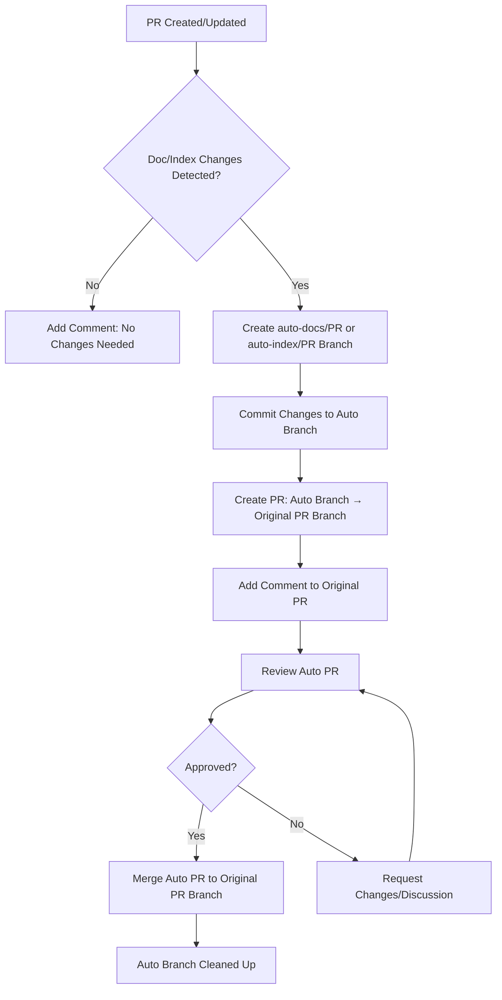

# 📚 Automated Documentation and Index Updates

## Overview

AitherZero implements an automated system for managing documentation and project index updates. This system ensures that generated documentation and index files are kept up-to-date while maintaining a clean commit history in the main project PRs.

## 🎯 Design Philosophy

The key principle behind this automation is **commit isolation**: automated documentation and index updates should not pollute the commit history of feature branches or main PRs. Instead, these updates are managed in separate branches and PRs that are merged into the parent PR when ready.

## 🔄 How It Works

### Documentation Automation Workflow

When a PR is created or updated with changes to code that affects documentation:

1. **Detection Phase**: The `documentation-automation.yml` workflow runs and generates updated documentation
2. **Branch Creation**: If changes are detected, a temporary branch `auto-docs/<pr-number>` is created from the PR's head
3. **Commit Changes**: Documentation changes are committed to the temporary branch with a clear automated commit message
4. **PR Creation**: A new PR is created from `auto-docs/<pr-number>` to the original PR branch
5. **Notification**: A comment is added to the original PR with a link to the auto-docs PR
6. **Review & Merge**: The auto-docs PR can be reviewed and merged into the parent PR branch when ready

### Index Automation Workflow

The same process applies for project index updates:

1. **Detection Phase**: The `index-automation.yml` workflow runs and regenerates index.md files for changed directories
2. **Branch Creation**: If changes are detected, a temporary branch `auto-index/<pr-number>` is created
3. **Commit Changes**: Index changes are committed to the temporary branch
4. **PR Creation**: A new PR is created from `auto-index/<pr-number>` to the original PR branch
5. **Notification**: A comment is added to the original PR with a link to the auto-index PR
6. **Review & Merge**: The auto-index PR can be reviewed and merged when ready

## 📊 Workflow Diagram



## 🏷️ Branch Naming Convention

| Workflow | Branch Pattern | Example |
|----------|---------------|---------|
| Documentation | `auto-docs/<pr-number>` | `auto-docs/123` |
| Index Updates | `auto-index/<pr-number>` | `auto-index/123` |

## 📝 Commit Message Format

### Documentation Updates
```
docs: update auto-generated documentation [auto-generated]

Automated documentation generation for PR #123

Generated: 15 Markdown files, 15 HTML files

This commit was automatically generated by the documentation automation workflow.
It updates documentation to reflect changes in the codebase.
```

### Index Updates
```
docs: update project indexes [auto-generated]

Automated index generation for PR #123

Updated: 8 index files
Mode: Incremental

This commit was automatically generated by the index automation workflow.
It updates index.md files to reflect changes in the project structure.
```

## 🎨 Benefits

### 1. **Clean Commit History**
The main PR only contains commits related to actual code/feature changes. Documentation and index updates are isolated in their own commits on separate branches.

### 2. **Better Review Process**
Reviewers can separately review:
- The actual code changes in the main PR
- The generated documentation in the auto-docs PR
- The index updates in the auto-index PR

### 3. **Flexibility**
If documentation or index generation produces unexpected results, the auto PR can be:
- Modified before merging
- Closed without affecting the main PR
- Regenerated by re-running the workflow

### 4. **Transparency**
Every documentation or index update is clearly marked as automated and includes:
- What was generated
- Why it was generated (linked to parent PR)
- When it was generated

## 🔧 Configuration

### Workflow Triggers

Both workflows are triggered by:
- **Push** to `main` or `develop` branches
- **Pull Request** to `main` or `develop` branches
- **Manual dispatch** with configurable options

### Permissions Required

The workflows require the following GitHub permissions:
- `contents: write` - To create branches and commit changes
- `pull-requests: write` - To create PRs and add comments

## 📋 Example Workflow

Let's walk through a complete example:

### Step 1: Create Feature PR
```bash
git checkout -b feature/new-api-endpoint
# Make changes to code
git commit -m "feat: add new API endpoint"
git push origin feature/new-api-endpoint
# Create PR #456
```

### Step 2: Automation Triggers
- Documentation workflow detects changes and creates `auto-docs/456`
- Index workflow detects changes and creates `auto-index/456`

### Step 3: Review Auto PRs
- PR #457: `auto-docs/456` → `feature/new-api-endpoint`
- PR #458: `auto-index/456` → `feature/new-api-endpoint`

### Step 4: Merge Auto PRs
```
Reviewer approves and merges PR #457 and PR #458
```

### Step 5: Main PR Ready
```
feature/new-api-endpoint now has:
- Original commit: "feat: add new API endpoint"
- Merged commit: "docs: update auto-generated documentation [auto-generated]"
- Merged commit: "docs: update project indexes [auto-generated]"
```

### Step 6: Merge Main PR
```
Merge PR #456 to main
```

## 🚨 Important Notes

### Auto PR Lifecycle
- Auto PRs are automatically closed if the parent PR is closed or merged
- Closing an auto PR does not affect the parent PR
- Auto branches can be recreated by re-running the workflow

### No Manual Modifications
- Auto PRs should not be manually modified
- If changes are needed, update the source code and re-run the workflow
- The workflow will update the existing auto PR or create a new one

### When Changes Aren't Detected
If no documentation or index changes are detected, the workflow will:
- Skip branch and PR creation
- Add a comment to the PR indicating no changes were needed
- Complete successfully without any action required

## 🔍 Troubleshooting

### Auto PR Not Created
**Issue**: Workflow runs but no auto PR is created

**Solution**: 
- Check workflow logs for "No changes detected" message
- Verify that documentation/index files were actually modified
- Ensure the workflow has proper permissions

### YAML Syntax Errors
**Issue**: Workflow fails with YAML parsing error

**Solution**:
- Template strings in JavaScript must maintain proper indentation
- Empty lines within template strings should have at least the base indentation
- Validate YAML syntax: `python3 -c "import yaml; yaml.safe_load(open('workflow.yml'))"`

### Auto PR Conflicts
**Issue**: Auto PR shows conflicts with parent branch

**Solution**:
- Close the auto PR
- Re-run the workflow to create a fresh auto PR from the latest parent branch state

## 📚 Related Documentation

- [CI/CD Guide](CI-CD-GUIDE.md)
- [Automated Workflow Chain](AUTOMATED-WORKFLOW-CHAIN.md)
- [Development Setup](DEVELOPMENT-SETUP.md)

## 🎓 Best Practices

1. **Review Auto PRs Promptly**: Don't let auto PRs accumulate
2. **Check Generated Content**: Verify that automation produced correct results
3. **Merge Before Main PR**: Always merge auto PRs before merging the main PR
4. **Don't Block on Auto PRs**: If auto PR has issues, fix the source and regenerate
5. **Keep Auto Branches Clean**: Auto branches are temporary and should be deleted after merge

---

*This automation system ensures AitherZero maintains comprehensive, up-to-date documentation and navigation indexes while keeping the development workflow clean and organized.*
