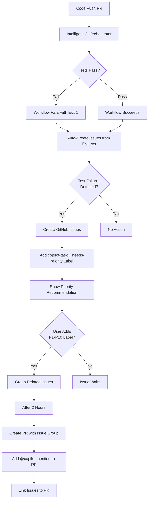

# Automated Testing and Issue Creation Workflow Chain

This document describes the complete automated workflow chain for testing, issue detection, GitHub Copilot integration, and PR-based issue resolution.

## Workflow Overview



## ⚠️ IMPORTANT: Priority Labels Required

**Issues will NOT be automatically processed unless they have a priority label (P1-P10).**

This gives you control over which issues to prioritize and prevents the system from automatically working on every issue.

### Phase 1: Issue Creation with Recommendations

1. **Issues Created:** System creates issues with `copilot-task` and `needs-priority` labels
2. **Recommendation Added:** Issue displays recommended priority (P1/P2/P3) based on severity
3. **You Choose Priority:** Add `P1` (critical) through `P10` (backlog) label based on your assessment
4. **Wait Period:** System waits 2 hours for manual review

### Phase 2: PR-Based Grouping

5. **Issue Grouping:** System groups related issues by type, file/domain, and priority
6. **PR Creation:** Automatically creates PR with grouped issues
7. **@copilot Assignment:** PR mentions @copilot (not individual issues)
8. **Progress Tracking:** Issues marked `in-progress` and linked to PR

### Priority Labels

- `P1` - Critical (4 hour SLA, work immediately)
- `P2` - High (24 hour SLA)
- `P3` - Medium (48 hour SLA)
- `P4` - Normal (1 week SLA)
- `P5` - Low (2 weeks SLA)
- `P6-P10` - Backlog (as capacity allows)

**Alternative:** Mention @copilot in a comment to manually trigger automation.

## Workflow Files

### 1. Intelligent CI Orchestrator
**File:** `.github/workflows/intelligent-ci-orchestrator.yml`

**Purpose:** Main CI/CD workflow that runs tests and validations

**Triggers:**
- Push to main/develop branches
- Pull requests
- Manual workflow_dispatch

**Key Features:**
- Smart change detection
- Parallelized test execution by category
- Proper exit codes: `exit 1` when tests fail
- Uploads test artifacts and reports

**Exit Codes:**
- `0` - All tests passed
- `1` - Tests failed (triggers downstream workflows)
- `>1` - Critical errors

### 2. Auto-Create Issues from Failures
**File:** `.github/workflows/auto-create-issues-from-failures.yml`

**Purpose:** Analyzes test results and creates targeted GitHub issues

**Triggers:**
- workflow_run: After "Intelligent CI Orchestrator" or "Quality Validation" completes
- Schedule: Daily at 7 AM UTC
- Manual workflow_dispatch

**Key Changes (2025-10-28):**
- ✅ Now triggers on ALL workflow_run events (not just failures)
- Previously only triggered when `workflow_run.conclusion == 'failure'`
- Can now analyze test artifacts even when workflow exits successfully

**Process:**
1. Downloads test artifacts from workflow run
2. Parses test reports (TestReport*.json, psscriptanalyzer*.json)
3. Groups failures by file/category
4. Creates/updates GitHub issues
5. Adds labels: `automated-issue`, `test-failure`, `code-quality`

### 3. Automated Copilot Agent
**File:** `.github/workflows/automated-copilot-agent.yml`

**Purpose:** Creates issues for copilot resolution and coordinates automation

**Triggers:**
- workflow_run: After "Intelligent CI Orchestrator" completes
- Schedule: Every hour during business hours (9 AM - 5 PM UTC, Mon-Fri)
- issues: When issues are opened or labeled
- pull_request: When PRs are opened, synchronized, or closed
- Manual workflow_dispatch

**Key Changes (2025-10-28):**
- ✅ Removed invalid `assignees: ['wizzense']` 
- Issues created with proper labels only
- @copilot mention moved to separate comment (avoids token recursion)

**Issue Creation:**
```javascript
{
  title: "🤖 [Issue Title]",
  labels: ['auto-created', 'copilot-task', 'priority-X', ...],
  // No assignees - copilot is not a real GitHub user
}
```

**Follow-up Comment:**
```
@copilot This issue has been automatically created...
```

### 4. Copilot PR Automation
**File:** `.github/workflows/copilot-pr-automation.yml`

**Purpose:** Monitors issues with copilot-task label and creates PRs

**Triggers:**
- issues: When assigned or labeled
- pull_request: When PRs are opened, synchronized, or closed
- Schedule: Every 4 hours during business days
- Manual workflow_dispatch

**Key Changes (2025-10-28):**
- ✅ Changed from `assignee: 'copilot'` to `labels: 'copilot-task'`
- ✅ Now requires priority labels (P1-P10) for auto-processing
- ✅ Filters issues by priority before creating PRs
- Now triggers on both 'assigned' and 'labeled' events
- Scans for issues with 'copilot-task' label

**Priority-Based Processing:**
- Only processes issues with P1-P10 labels
- Respects 2-hour minimum age (allows manual triage)
- Limits to 5 concurrent issues for performance
- Can be overridden with manual workflow_dispatch

**Automated PR Creation:**
- Analyzes issue labels and content
- Applies PSScriptAnalyzer automatic fixes
- Addresses test failures
- Adds security suppressions
- Creates PR with fixes
- Links back to original issue

### 5. Copilot Issue Commenter
**File:** `.github/workflows/copilot-issue-commenter.yml`

**Purpose:** Adds detailed instructions to issues after creation

**Triggers:**
- workflow_run: After "Automated Copilot Agent" completes
- Manual workflow_dispatch for specific issues

**Process:**
1. Finds recently created issues with 'auto-created' label
2. Checks if comment already added (avoids duplicates)
3. Adds comprehensive task instructions with:
   - Analysis phase steps
   - Implementation guidelines
   - Validation commands
   - PR creation process
   - Success criteria checklist

### 6. Config Validation
**File:** `.github/workflows/validate-config.yml`

**Purpose:** Automatically validates config.psd1 synchronization with automation scripts

**Triggers:**
- Push to main/develop branches (when config.psd1 or scripts change)
- Pull requests (when config.psd1 or scripts change)
- Manual workflow_dispatch

**Process:**
1. **Config Validation (0413):** Validates structure, counts, and references
2. **Config Sync (0003):** Ensures all automation scripts are registered in config.psd1
3. Fails CI if scripts are missing from config.psd1
4. Provides instructions on how to fix missing registrations

**Automatic Execution:**
- Runs whenever automation scripts are added/modified
- Runs whenever config.psd1 is changed
- Ensures config stays synchronized automatically
- Exit code 1 if sync issues found, preventing merge

**Output Example:**
```
✅ Found 119 automation scripts
✅ Found 119 scripts registered in config.psd1
✅ Configuration is in sync
```

**When It Fails:**
```
⚠️ Missing scripts found:
  0000-0099:
    • 0003 - 0003_New-Script.ps1
    
To fix:
  1. Run: pwsh -File ./automation-scripts/0003_Sync-ConfigManifest.ps1
  2. Review the missing scripts listed above
  3. Add script numbers to appropriate sections in config.psd1
  4. Commit the changes
```

### 7. Auto-Create PRs for Prioritized Issues (Phase 2)
**File:** `.github/workflows/auto-create-prs-for-issues.yml`

**Purpose:** Groups related prioritized issues and creates PRs automatically

**Triggers:**
- When P1-P10 label added to issue
- Schedule: Every 4 hours
- Manual workflow_dispatch

**Grouping Strategy:**
1. **By Type:** code-quality, testing, security, maintenance
2. **By File/Domain:** Analyzes file paths in issue body
   - `domains/configuration` → `domain-configuration`
   - `automation-scripts/08XX` → `scripts-08xx`
   - `tests/` → `tests`
3. **By Priority:** P1-P10 ensures similar urgency grouped

**PR Creation Rules:**
- Groups with 2+ issues: Always create PR
- Single P1/P2 issues: Create individual PR
- Single P3-P10 issues: Handled by existing copilot-pr-automation workflow
- Wait 2 hours after P1-P10 label for manual review

**Process:**
1. Scans for open issues with `copilot-task` label and P1-P10 priority
2. Groups related issues intelligently
3. Creates branch: `auto-fix/{type}-{context}-{priority}-{timestamp}`
4. Creates PR with:
   - Title: `🤖 [P2] Fix {type} issues in {context}`
   - Body: Summary + links to all issues (Fixes #123)
   - @copilot mention for implementation
5. Updates each issue:
   - Comment with PR link
   - Adds `in-progress` label
   - Links back to PR for tracking

**Example PR:**
```markdown
Title: 🤖 [P2] Fix code-quality issues in domain-configuration

Issues Addressed:
- Fixes #45: PSScriptAnalyzer error in Configuration.psm1
- Fixes #47: Missing parameter validation in Set-Config

@copilot Please analyze the linked issues and implement fixes...
```

**Benefits:**
- ✅ Related issues fixed together (not individually)
- ✅ Single PR review instead of multiple
- ✅ Better context for @copilot
- ✅ Clear progress tracking
- ✅ Reduced notification noise

## GitHub Copilot Integration

### Priority Label Requirement (NEW)

**Issues now require a priority label before automated processing:**

1. **Issue Created** with `copilot-task` label
2. **Instructions Added** explaining priority labels
3. **You Add Priority** label (P1-P10) when ready
4. **After 2 Hours** system picks up prioritized issues
5. **Copilot Works** on issues with priority labels

**Why Priority Labels?**
- Gives you control over which issues to work on
- Prevents system from automatically working on everything
- Allows manual triage and prioritization
- Focus resources on most important issues

### How @copilot Mentions Work

GitHub Copilot Workspace is triggered by **@copilot mentions in issue comments** OR **priority labels**:

1. **Issue Created:** Workflow creates issue with `copilot-task` label
2. **Comment Added:** Separate workflow posts `@copilot [instructions]` comment
3. **Copilot Activated:** GitHub Copilot Workspace detects mention and activates
4. **Agent Works:** Copilot analyzes issue and creates implementation
5. **PR Created:** Copilot submits PR to resolve the issue

### Important Notes

- ❌ `assignees: ['copilot']` - Invalid (copilot is not a GitHub user)
- ✅ `labels: ['copilot-task']` - Correct way to mark issues
- ✅ `@copilot in comment` - Triggers GitHub Copilot Workspace
- ✅ Separate comment avoids GITHUB_TOKEN recursion issues

## Test Exit Codes

### Before Fix (Incorrect)
```powershell
# Tests fail but workflow succeeds
if ($testsFailed -gt 0) {
  Write-Host "Tests failed"
}
exit 0  # Always exits 0 ❌
```

### After Fix (Correct)
```powershell
# Tests fail and workflow fails
if ($testsFailed -gt 0) {
  Write-Host "::error::Tests failed"
  exit 1  # Properly fails ✅
} else {
  exit 0
}
```

## Workflow Dependencies

```
intelligent-ci-orchestrator (runs tests)
    ↓ workflow_run
auto-create-issues-from-failures (analyzes results)
    ↓ creates issues
automated-copilot-agent (coordinates automation)
    ↓ workflow_run
copilot-issue-commenter (adds instructions)
    ↓ labels/opens issue
copilot-pr-automation (monitors and creates PRs)
```

## Testing the Workflow Chain

### Method 1: Trigger from Test Failure

1. Create a failing test:
```powershell
Describe "Test That Fails" {
    It "Should fail intentionally" {
        1 | Should -Be 2
    }
}
```

2. Push to a PR or main/develop branch
3. Watch workflow execute: Intelligent CI Orchestrator → should fail
4. Check for automatic issue creation (within minutes)
5. Verify @copilot comment appears on issue
6. Monitor for PR creation (may take 2+ hours based on schedule)

### Method 2: Manual Workflow Dispatch

1. Go to Actions → "Automated Copilot Agent"
2. Click "Run workflow"
3. Set `force_analyze: true`
4. Watch for issues to be created
5. Check issues have 'copilot-task' label and @copilot comment

### Method 3: Test Issue Creation Script

```powershell
# Note: Issue generation scripts were removed as part of documentation cleanup
# Issues should be created manually via GitHub Issues UI or gh CLI
```

## Monitoring and Debugging

### Check Workflow Runs
```bash
gh run list --workflow="intelligent-ci-orchestrator.yml" --limit 5
gh run list --workflow="automated-copilot-agent.yml" --limit 5
```

### View Workflow Logs
```bash
gh run view <run-id> --log
```

### Check for Created Issues
```bash
gh issue list --label "auto-created" --limit 10
gh issue list --label "copilot-task" --limit 10
```

### Verify Test Artifacts
- Go to workflow run
- Check "Artifacts" section
- Download test results and reports

## Troubleshooting

### Issue: Tests fail but no issues created

**Possible Causes:**
1. Workflow exited with 0 instead of 1 ✅ Fixed
2. Test artifacts not uploaded properly
3. auto-create-issues-from-failures not triggered ✅ Fixed

**Solution:**
- Check workflow run logs for exit codes
- Verify artifacts were uploaded
- Manually trigger auto-create-issues-from-failures

### Issue: Issues created but copilot not responding

**Possible Causes:**
1. No @copilot mention in issue body ✅ Use separate comment
2. Invalid copilot user assignment ✅ Fixed
3. Missing copilot-task label ✅ Fixed

**Solution:**
- Check issue has copilot-task label
- Verify @copilot comment was posted
- Manually add @copilot comment if missing

### Issue: copilot-pr-automation not creating PRs

**Possible Causes:**
1. Issues not old enough (2 hour threshold)
2. Looking for invalid 'copilot' assignee ✅ Fixed
3. Schedule not running

**Solution:**
- Wait 2+ hours or manually trigger workflow
- Force PR creation with workflow_dispatch
- Check workflow has proper permissions

## Best Practices

1. **Always use proper exit codes:** Exit 1 for failures, 0 for success
2. **Use labels for automation:** Don't rely on invalid user assignments
3. **@copilot mentions in comments:** Avoid in issue body (token recursion)
4. **Test workflow chain:** Use manual triggers to verify end-to-end
5. **Monitor artifacts:** Check test reports are uploaded correctly
6. **Review logs:** Check for errors in workflow execution

## Future Improvements

- [ ] Add real-time monitoring dashboard
- [ ] Implement health checks for automation system
- [ ] Add metrics collection for issue resolution time
- [ ] Create automated rollback on critical failures
- [ ] Add notification system for failed workflows
- [ ] Implement priority-based issue resolution
- [ ] Add automated PR merge for simple fixes

## Related Documentation

- [GitHub Copilot Workspace Docs](https://docs.github.com/en/copilot/github-copilot-workspace)
- [GitHub Actions workflow_run](https://docs.github.com/en/actions/using-workflows/events-that-trigger-workflows#workflow_run)
- [Pester Testing Framework](https://pester.dev/)
- [PSScriptAnalyzer Rules](https://github.com/PowerShell/PSScriptAnalyzer)

## Changelog

### 2025-10-28 - Major Fixes
- ✅ Fixed test exit codes in intelligent-ci-orchestrator.yml
- ✅ Fixed auto-create-issues trigger condition
- ✅ Removed invalid copilot user assignments
- ✅ Updated copilot-pr-automation to use labels
- ✅ Documented complete workflow chain

### Previous Versions
- Complex workflow system with multiple overlapping responsibilities
- Tests failed silently with exit 0
- Invalid copilot user assignments
- Workflow chain not properly connected
