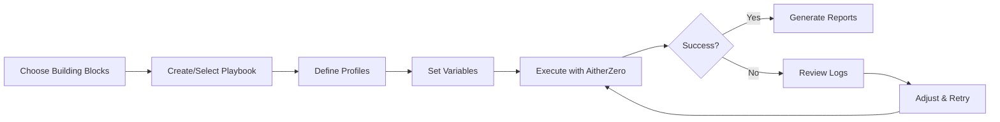

# AitherZero Building-Block System - Index

**Version**: 2.0  
**Last Updated**: 2025-11-04  
**Status**: Production Ready

## 🎯 Quick Access

| Resource | Purpose | Size | Link |
|----------|---------|------|------|
| **Quick Reference** | Script lookup, common patterns | 10KB | [BUILDING-BLOCKS-QUICK-REFERENCE.md](./BUILDING-BLOCKS-QUICK-REFERENCE.md) |
| **Complete Guide** | Full documentation, all blocks | 38KB | [BUILDING-BLOCKS.md](./BUILDING-BLOCKS.md) |
| **Reorganization Plan** | Git automation logical grouping | 11KB | [BUILDING-BLOCKS-REORGANIZATION.md](./BUILDING-BLOCKS-REORGANIZATION.md) |
| **Playbook Template** | Base template for custom playbooks | 6KB | [../orchestration/playbooks/templates/custom-playbook-template.json](../orchestration/playbooks/templates/custom-playbook-template.json) |
| **Example Playbook** | Production-ready example | 7KB | [../orchestration/playbooks/custom/endpoint-configuration-example.json](../orchestration/playbooks/custom/endpoint-configuration-example.json) |
| **Custom Playbooks Guide** | How to create custom playbooks | 9KB | [../orchestration/playbooks/custom/README.md](../orchestration/playbooks/custom/README.md) |

## 📦 Building-Block System Overview

### What Are Building Blocks?

Building blocks are **134 automation scripts** (numbered 0000-9999) that can be combined like LEGO pieces to create custom automation workflows. Each block is:

- ✅ **Self-contained**: Works independently
- ✅ **Parameterized**: Accepts configuration variables
- ✅ **Composable**: Combines with other blocks
- ✅ **Cross-platform**: Runs on Windows, Linux, macOS (where applicable)
- ✅ **Well-documented**: Has metadata describing purpose and dependencies

### Script Categories

```
┌─────────────────────────────────────────────────────────────┐
│  0000-0099: Environment Prep (11 scripts)                   │
│  ├─ PowerShell 7 installation                               │
│  ├─ Directory setup                                          │
│  └─ Validation tools                                         │
├─────────────────────────────────────────────────────────────┤
│  0100-0199: Infrastructure (6 scripts)                       │
│  ├─ Hyper-V, WSL2 (Windows)                                 │
│  └─ Certificates, system config                             │
├─────────────────────────────────────────────────────────────┤
│  0200-0299: Development Tools (19 scripts)                  │
│  ├─ Languages: Node, Python, Go                             │
│  ├─ Tools: Git, Docker, VS Code                             │
│  └─ CLIs: Azure, AWS, Chocolatey                            │
├─────────────────────────────────────────────────────────────┤
│  0400-0499: Testing & Validation (26 scripts)               │
│  ├─ Unit & integration tests                                │
│  ├─ Code quality checks                                     │
│  └─ Syntax validation                                       │
├─────────────────────────────────────────────────────────────┤
│  0500-0599: Reporting & Metrics (25 scripts)                │
│  ├─ Project reports                                         │
│  ├─ Code quality analysis                                   │
│  └─ Tech debt tracking                                      │
├─────────────────────────────────────────────────────────────┤
│  0700-0799: Development Workflows (35 scripts)              │
│  ├─ Git workflows (0700-0709)                               │
│  ├─ GitHub/CI integration (0720-0729)                       │
│  ├─ AI-powered development (0730-0749)                      │
│  └─ MCP servers (0750-0759)                                 │
├─────────────────────────────────────────────────────────────┤
│  0800-0899: Issue Management & Deployment (19 scripts)      │
│  ├─ Automated issue creation                                │
│  ├─ PR environment deployment                               │
│  └─ Workflow automation                                     │
├─────────────────────────────────────────────────────────────┤
│  0900-0999: Test Generation (3 scripts)                     │
│  └─ Automated test generation                               │
└─────────────────────────────────────────────────────────────┘
```

### Total: 134 Active Scripts (No obsolete scripts found)

## 🚀 Getting Started

### 1. Choose Your Path

**Option A: Use Pre-Built Recipes** (Fastest)
```powershell
# Minimal setup (5 blocks, ~10 min)
./Start-AitherZero.ps1 -Mode Orchestrate -Playbook custom-playbook-template -Profile minimal

# Web development (10 blocks, ~30-45 min)
./Start-AitherZero.ps1 -Mode Orchestrate -Playbook endpoint-configuration-example -Profile web-development

# Python data science (8 blocks, ~25-35 min)
./Start-AitherZero.ps1 -Mode Orchestrate -Playbook endpoint-configuration-example -Profile python-datascience

# AI-powered development (12 blocks, ~30-40 min)
./Start-AitherZero.ps1 -Mode Orchestrate -Playbook endpoint-configuration-example -Profile ai-powered-development

# Cloud DevOps (10 blocks, ~25-35 min)
./Start-AitherZero.ps1 -Mode Orchestrate -Playbook endpoint-configuration-example -Profile cloud-devops
```

**Option B: Create Custom Playbook** (Most Flexible)
```powershell
# 1. Copy template
cp orchestration/playbooks/templates/custom-playbook-template.json orchestration/playbooks/custom/my-playbook.json

# 2. Edit my-playbook.json to define your blocks and profiles

# 3. Test with dry-run
./Start-AitherZero.ps1 -Mode Orchestrate -Playbook my-playbook -DryRun

# 4. Execute
./Start-AitherZero.ps1 -Mode Orchestrate -Playbook my-playbook
```

**Option C: Direct Script Execution** (Most Control)
```powershell
# Execute individual scripts
& ./automation-scripts/0001_Ensure-PowerShell7.ps1
& ./automation-scripts/0207_Install-Git.ps1
& ./automation-scripts/0201_Install-Node.ps1
```

### 2. Understand the Workflow



### 3. Read the Documentation

1. **Start here**: [BUILDING-BLOCKS-QUICK-REFERENCE.md](./BUILDING-BLOCKS-QUICK-REFERENCE.md) - 5 min read
2. **Go deeper**: [BUILDING-BLOCKS.md](./BUILDING-BLOCKS.md) - 15 min read
3. **Understand organization**: [BUILDING-BLOCKS-REORGANIZATION.md](./BUILDING-BLOCKS-REORGANIZATION.md) - 10 min read
4. **Create playbooks**: [../orchestration/playbooks/custom/README.md](../orchestration/playbooks/custom/README.md) - 10 min read

## 📖 Documentation Structure

### Primary Documentation

#### 1. BUILDING-BLOCKS-QUICK-REFERENCE.md
**Purpose**: Quick lookup and common patterns  
**Content**:
- Script number ranges summary
- Essential building-block combinations
- Platform-specific blocks
- Common workflow patterns with code examples
- Configuration parameter reference
- Exit codes and troubleshooting

**Best for**: Daily reference, quick lookups, copy-paste recipes

#### 2. BUILDING-BLOCKS.md
**Purpose**: Complete reference guide  
**Content**:
- All 134 scripts with full details
- Dependencies and duration estimates
- 25+ recipe library
- Parameter-driven configuration guide
- Building-block patterns (multi-env, parallel, conditional)
- Advanced topics and best practices

**Best for**: Understanding all capabilities, planning complex workflows

#### 3. BUILDING-BLOCKS-REORGANIZATION.md
**Purpose**: Architectural decisions and rationale  
**Content**:
- Git automation reorganization (0700-0799 logically part of dev tools)
- Logical vs physical addressing
- No breaking changes approach
- Future extensibility roadmap

**Best for**: Understanding architecture decisions, contributing to project

### Playbook Documentation

#### 4. custom-playbook-template.json
**Purpose**: Base template for custom playbooks  
**Content**:
- 3 profiles (minimal, standard, complete)
- 5 example stages
- Conditional execution
- Validation and reporting
- Inline documentation

**Best for**: Starting point for new playbooks

#### 5. endpoint-configuration-example.json
**Purpose**: Production-ready example  
**Content**:
- 5 profiles (minimal, web, python, AI, cloud)
- 11 stages with proper error handling
- Complex conditional logic
- Post-execution validation

**Best for**: Learning advanced patterns, real-world reference

#### 6. custom/README.md
**Purpose**: User guide for custom playbooks  
**Content**:
- Step-by-step creation guide
- Building blocks reference
- Common patterns and best practices
- Troubleshooting guide

**Best for**: Creating your first custom playbook

## 🎨 Common Use Cases

### Developer Workstation Setup
**Scenario**: Set up a new development machine  
**Duration**: 30-45 minutes  
**Playbook**: `endpoint-configuration-example -Profile web-development`  
**Blocks**: 0001, 0002, 0207, 0201, 0208, 0210, 0400, 0402, 0510

### CI/CD Runner Configuration
**Scenario**: Configure a CI/CD build agent  
**Duration**: 20-30 minutes  
**Playbook**: Custom or use minimal profile  
**Blocks**: 0001, 0002, 0207, 0208, 0400, 0006

### Python Data Science Environment
**Scenario**: Set up Python with Jupyter and data tools  
**Duration**: 25-35 minutes  
**Playbook**: `endpoint-configuration-example -Profile python-datascience`  
**Blocks**: 0001, 0002, 0207, 0206, 0204, 0210

### Cloud DevOps Toolkit
**Scenario**: Install cloud CLIs and IaC tools  
**Duration**: 25-35 minutes  
**Playbook**: `endpoint-configuration-example -Profile cloud-devops`  
**Blocks**: 0001, 0002, 0207, 0212, 0213, 0008, 0009, 0208, 0214

### AI-Powered Development
**Scenario**: Set up AI-assisted development environment  
**Duration**: 30-40 minutes  
**Playbook**: `endpoint-configuration-example -Profile ai-powered-development`  
**Blocks**: 0001, 0002, 0010, 0207, 0201, 0210, 0730, 0740, 0743

### Windows Hyper-V Lab
**Scenario**: Create virtualization lab on Windows  
**Duration**: 30-60 minutes  
**Platform**: Windows only  
**Blocks**: 0001, 0002, 0105, 0104, 0107, 0112

### Quick Validation
**Scenario**: Fast validation during development  
**Duration**: 2-5 minutes  
**Playbook**: `test-quick`  
**Blocks**: 0400, 0407, 0402, 0404

### Pre-Commit Check
**Scenario**: Validation before committing code  
**Duration**: 5-10 minutes  
**Playbook**: `test-standard`  
**Blocks**: 0407, 0402, 0404, 0420

## 🔧 Advanced Features

### Profile-Based Execution
Run the same playbook with different configurations:
```powershell
# Quick setup
./Start-AitherZero.ps1 -Mode Orchestrate -Playbook my-playbook -Profile minimal

# Complete setup
./Start-AitherZero.ps1 -Mode Orchestrate -Playbook my-playbook -Profile complete
```

### Custom Variables
Override default values:
```powershell
./Start-AitherZero.ps1 -Mode Orchestrate -Playbook my-playbook -Variables @{
    environment = "Production"
    includeAI = $true
    parallel = $true
}
```

### Conditional Execution
Stages execute based on conditions:
```json
{
  "condition": "{{includeDocker}} -and $IsWindows"
}
```

### Parallel Execution
Independent blocks run simultaneously:
```json
{
  "parallel": true,
  "maxConcurrency": 4
}
```

### Error Handling
Configure continue-on-error behavior:
```json
{
  "continueOnError": true
}
```

## 📊 Statistics

- **Total Scripts**: 134 automation scripts
- **Total Documentation**: 58KB across 6 documents
- **Script Categories**: 8 major categories
- **Common Recipes**: 25+ pre-built patterns
- **Example Playbooks**: 2 production-ready examples
- **Profiles Available**: 8 pre-configured profiles
- **Platforms Supported**: Windows, Linux, macOS
- **Obsolete Scripts**: 0 (all scripts are active)

## 🤝 Contributing

### Share Your Playbooks
1. Create a useful custom playbook
2. Test it thoroughly
3. Document it well
4. Submit a PR to share with community

### Improve Documentation
- Found a typo? Submit a PR
- Have a great recipe? Add it to the docs
- Discovered a pattern? Share it

### Add New Building Blocks
1. Create new automation script in `automation-scripts/`
2. Follow numbering convention (0000-9999)
3. Add proper metadata (Stage, Dependencies, Description, Tags)
4. Document in BUILDING-BLOCKS.md
5. Add tests in `tests/`

## 🔗 Related Resources

- **Orchestration Engine**: `domains/automation/OrchestrationEngine.psm1`
- **Schema Reference**: `orchestration/schema/playbook-schema-v3.json`
- **Core Playbooks**: `orchestration/playbooks/core/`
- **Testing Framework**: `domains/testing/TestingFramework.psm1`
- **Configuration System**: `config.psd1`

## ❓ Support & Help

### Quick Help
```powershell
# View script metadata
Get-Content ./automation-scripts/0207_Install-Git.ps1 | Select-String "^# Stage:|^# Dependencies:"

# Dry-run playbook
./Start-AitherZero.ps1 -Mode Orchestrate -Playbook my-playbook -DryRun

# Enable verbose output
$VerbosePreference = 'Continue'
./Start-AitherZero.ps1 -Mode Orchestrate -Playbook my-playbook -Verbose
```

### Documentation
- Read the quick reference first
- Check the complete guide for details
- Review example playbooks for patterns
- Refer to custom README for creation guide

### Troubleshooting
- Validate JSON syntax with `jq` or `ConvertFrom-Json`
- Check script exit codes (`$LASTEXITCODE`)
- Review transcript logs in `logs/`
- Run with `-DryRun` to see execution plan
- Enable verbose logging with `-Verbose`

---

## 🎉 You're Ready!

You now have access to a powerful building-block system that can:
- ✅ Automate any endpoint configuration
- ✅ Create custom extensible workflows
- ✅ Combine 134 parameterized scripts
- ✅ Support multiple platforms
- ✅ Handle complex conditional logic
- ✅ Execute blocks in parallel
- ✅ Generate comprehensive reports

**Start automating today!** 🚀
