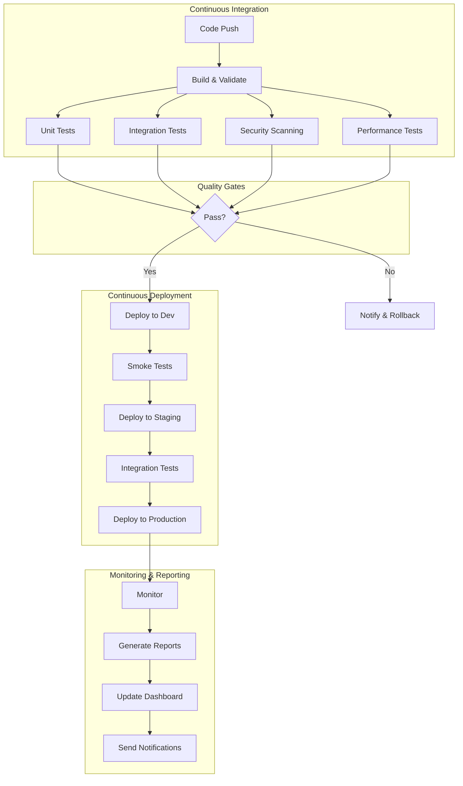

# 🚀 AitherZero CI/CD Guide

## Overview

AitherZero implements a comprehensive, production-grade CI/CD pipeline that ensures code quality, automates testing, manages releases, and provides complete visibility into the development lifecycle.

## 📊 Pipeline Architecture



## 🔧 Workflows

### 1. **Production CI/CD Pipeline** (`ci-cd-pipeline.yml`)
   - **Trigger**: Push, PR, Tags, Schedule, Manual
   - **Stages**:
     - Build & Validate
     - Multi-platform Testing
     - Security Scanning
     - Performance Testing
     - Documentation Generation
     - Release Management
     - Dashboard Deployment

### 2. **Continuous Deployment** (`continuous-deployment.yml`)
   - **Trigger**: Successful CI/CD Pipeline
   - **Environments**:
     - Development (auto-deploy)
     - Staging (with smoke tests)
     - Production (with approval)
   - **Features**:
     - Blue-green deployments
     - Automatic rollback
     - Backup creation

### 3. **Monitoring & Reporting** (`monitoring-reporting.yml`)
   - **Trigger**: Schedule (6h, weekly), Manual
   - **Features**:
     - Metrics collection
     - Report generation
     - Issue creation
     - Dashboard updates

## 📈 Test Results & Reporting

### Accessing Reports

1. **GitHub Pages Dashboard**
   ```
   https://<username>.github.io/AitherZero/
   ```

2. **Direct Report Links**
   - Test Results: `/reports/latest/test-report.html`
   - Coverage: `/reports/latest/coverage-report.html`
   - Performance: `/reports/latest/performance-report.html`
   - Security: `/reports/latest/security-report.html`

3. **Artifacts**
   - Available in Actions tab
   - Retained for 30 days
   - Downloadable as ZIP

### Report Types

| Report | Frequency | Content |
|--------|-----------|---------|
| Test Results | Every run | Pass/fail, duration, details |
| Code Coverage | Every run | Line/branch coverage |
| Performance | Every run | Benchmarks, thresholds |
| Security | Every run | Vulnerabilities, CVEs |
| Tech Debt | Weekly | Code quality metrics |
| Executive | Weekly | High-level summary |

## 🎯 Quality Gates

### Required Checks
- ✅ All tests passing
- ✅ Code coverage > 70%
- ✅ No critical security issues
- ✅ PSScriptAnalyzer passing
- ✅ Performance within thresholds

### Branch Protection
```yaml
main:
  - Require PR reviews (2)
  - Require status checks
  - Require up-to-date branches
  - Include administrators

develop:
  - Require PR reviews (1)
  - Require status checks
  
feature/*:
  - No restrictions
```

## 🚀 Deployment Process

### Environments

| Environment | URL | Auto-Deploy | Approval |
|------------|-----|-------------|----------|
| Development | dev.aitherzero.example.com | Yes | No |
| Staging | staging.aitherzero.example.com | After Dev | No |
| Production | aitherzero.example.com | After Staging | Yes |

### Deployment Strategy

1. **Blue-Green Deployment**
   - Deploy to inactive environment
   - Run health checks
   - Switch traffic
   - Monitor for issues
   - Rollback if needed

2. **Rollback Procedure**
   - Automatic on failure
   - Restores from backup
   - Notifies team
   - Creates incident issue

## 📦 Release Management

### Versioning
- **Format**: `MAJOR.MINOR.PATCH-PRERELEASE+BUILD`
- **Examples**:
  - Release: `1.2.3`
  - Pre-release: `1.2.3-rc.1`
  - Development: `1.2.3-dev.456+abc123`

### Release Process
1. Tag creation triggers release
2. Build and test
3. Generate release notes
4. Create GitHub release
5. Publish to PowerShell Gallery
6. Deploy to production

### Release Artifacts
- ZIP package (Windows)
- TAR.GZ package (Unix)
- SHA256 checksums
- Release notes
- API documentation

## 🔔 Notifications

### Channels
- **Slack**: Build status, deployments
- **Email**: Failures, weekly reports
- **GitHub Issues**: Weekly metrics
- **Dashboard**: Real-time status

### Configuration
Set these secrets/variables in GitHub:
```yaml
Secrets:
  - SLACK_WEBHOOK_URL
  - EMAIL_USERNAME
  - EMAIL_PASSWORD
  - PSGALLERY_API_KEY
  - AWS_ROLE_ARN_*

Variables:
  - EMAIL_RECIPIENTS
  - REPORT_RECIPIENTS
  - SLACK_CHANNEL
```

## 📊 Metrics & KPIs

### Build Metrics
- Success rate
- Average duration
- Failure patterns
- Recovery time

### Code Metrics
- Lines of code
- Complexity
- Duplication
- Technical debt

### Test Metrics
- Total tests
- Pass rate
- Coverage
- Execution time

### Deployment Metrics
- Frequency
- Lead time
- MTTR
- Change failure rate

## 🛠️ Local Testing

### Run CI/CD Locally
```powershell
# Install act for local GitHub Actions
./az.ps1 0441 -InstallDependencies

# Test specific workflow
act -W .github/workflows/ci-cd-pipeline.yml

# Test with specific event
act pull_request -W .github/workflows/ci-cd-pipeline.yml
```

### Generate Reports Locally
```powershell
# Run tests and generate reports
./Start-AitherZero.ps1 -Mode Orchestrate -Playbook test-full

# Publish results
./az.ps1 0450  # Publish test results

# View locally
Start-Process "./docs/reports/latest/test-report.html"
```

## 🔒 Security

### Secrets Management
- Use GitHub Secrets for sensitive data
- Rotate credentials regularly
- Use OIDC for cloud providers
- Implement least privilege

### Scanning
- Trivy for container scanning
- OWASP dependency check
- PSScriptAnalyzer for code
- GitHub Advanced Security

## 🎯 Best Practices

1. **Keep Workflows DRY**
   - Use reusable workflows
   - Share common actions
   - Centralize configuration

2. **Optimize Performance**
   - Use caching
   - Parallelize tests
   - Conditional steps
   - Matrix strategies

3. **Ensure Reliability**
   - Implement retries
   - Add timeouts
   - Handle failures gracefully
   - Monitor flaky tests

4. **Maintain Visibility**
   - Comprehensive logging
   - Clear status badges
   - Detailed reports
   - Actionable notifications

## 📚 Resources

- [GitHub Actions Documentation](https://docs.github.com/actions)
- [PowerShell Testing Guide](https://pester.dev)
- [CI/CD Best Practices](https://www.atlassian.com/continuous-delivery/principles/continuous-integration-vs-delivery-vs-deployment)
- [AitherZero Dashboard](https://aitherzero.github.io)

## 🤝 Contributing

### Adding New Workflows
1. Create workflow in `.github/workflows/`
2. Follow naming convention
3. Add documentation
4. Test locally with `act`
5. Submit PR

### Modifying Pipelines
1. Test changes in feature branch
2. Use workflow_dispatch for testing
3. Validate all quality gates
4. Update documentation

## 📞 Support

- **Issues**: [GitHub Issues](https://github.com/wizzense/AitherZero/issues)
- **Discussions**: [GitHub Discussions](https://github.com/wizzense/AitherZero/discussions)
- **Dashboard**: [Live Status](https://wizzense.github.io/AitherZero)

---

*Last Updated: 2025-08-13*