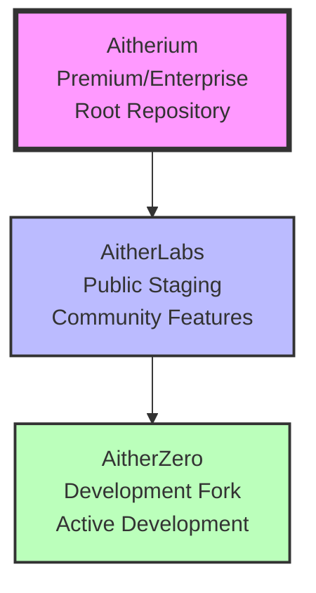
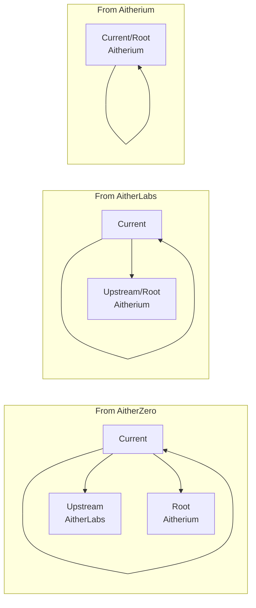
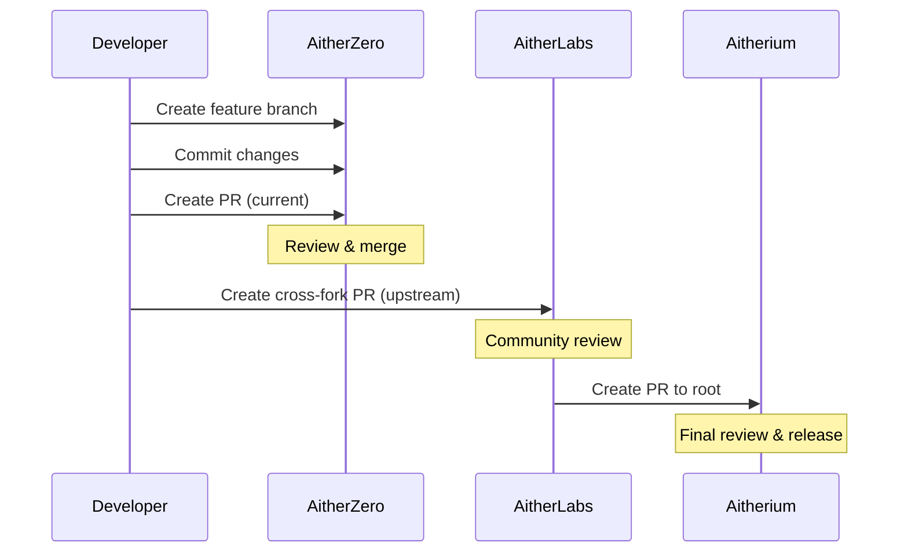

# Fork Chain Architecture

## Overview

AitherZero uses a three-tier fork chain architecture that enables seamless development, staging, and production workflows. The dynamic repository detection system allows the same codebase to work across all forks without any hardcoded references.

## Fork Chain Hierarchy



## Repository Details

### 1. AitherZero (Development Fork)
- **Owner**: wizzense
- **Type**: Development
- **Purpose**: Active development, experimental features, testing
- **Upstream**: AitherLabs
- **Root**: Aitherium

### 2. AitherLabs (Public Repository)
- **Owner**: Aitherium
- **Type**: Public
- **Purpose**: Community features, public staging, documentation
- **Upstream**: Aitherium
- **Root**: Aitherium

### 3. Aitherium (Premium Repository)
- **Owner**: Aitherium
- **Type**: Premium/Enterprise
- **Purpose**: Stable releases, enterprise features, production
- **Upstream**: None (this is the root)
- **Root**: Aitherium

## Dynamic Repository Detection

The system uses `Get-GitRepositoryInfo` to automatically detect the current repository context:

```powershell
$repoInfo = Get-GitRepositoryInfo

# Returns:
# @{
#     Owner = 'wizzense'
#     Name = 'AitherZero'
#     FullName = 'wizzense/AitherZero'
#     GitHubRepo = 'wizzense/AitherZero'
#     CurrentBranch = 'main'
#     Type = 'Development'
#     Remotes = @(...)
#     ForkChain = @('AitherZero', 'AitherLabs', 'Aitherium')
# }
```

## Cross-Fork Operations

### Pull Request Targets



### Creating Cross-Fork PRs

```powershell
# PR to current repository (same fork)
New-CrossForkPR -Title "Feature X" -Body "Description" -TargetFork "current"

# PR to upstream (next level up)
New-CrossForkPR -Title "Feature X" -Body "Description" -TargetFork "upstream"

# PR to root (Aitherium)
New-CrossForkPR -Title "Feature X" -Body "Description" -TargetFork "root"
```

## Workflow Examples

### Development Workflow



### Issue Creation Flow

Issues are created in the current repository by default, but can be created in any repository in the chain:

```powershell
# Create issue in current repository
New-PatchIssue -Title "Bug Report" -Body "Description"

# The repository is automatically detected
$repoInfo = Get-GitRepositoryInfo
$targetRepo = $repoInfo.GitHubRepo  # e.g., "wizzense/AitherZero"
```

## Remote Configuration

Each repository in the fork chain should have appropriate remotes configured:

### AitherZero Setup
```bash
# Origin (your fork)
git remote add origin https://github.com/wizzense/AitherZero.git

# Upstream (public repository)
git remote add upstream https://github.com/Aitherium/AitherLabs.git

# Root (premium repository)
git remote add root https://github.com/Aitherium/Aitherium.git
```

### AitherLabs Setup
```bash
# Origin (public repository)
git remote add origin https://github.com/Aitherium/AitherLabs.git

# Upstream/Root (premium repository)
git remote add upstream https://github.com/Aitherium/Aitherium.git
```

## Benefits of Dynamic Detection

1. **No Hardcoded Values**: The same code works across all forks
2. **Automatic Context**: Operations use the correct repository automatically
3. **Fork Independence**: Each fork can be worked on independently
4. **Seamless Integration**: PRs and issues flow naturally up the chain
5. **Flexibility**: New forks can be added without code changes

## PatchManager Integration

PatchManager leverages this architecture for all Git operations:

```powershell
# Standard workflow - uses dynamic detection
Invoke-PatchWorkflow -PatchDescription "Fix issue #123" -PatchOperation {
    # Your changes here
} -CreatePR

# The PR is created in the correct repository automatically
```

## Performance Characteristics

- Repository detection: < 50ms average
- Cached detection: < 10ms average
- Cross-fork PR creation: < 2s
- Issue creation: < 1s

## Best Practices

1. **Always Use Dynamic Detection**: Never hardcode repository names
2. **Configure Remotes**: Ensure proper remote setup for cross-fork operations
3. **Follow the Flow**: Changes flow up from development → public → premium
4. **Use PatchManager**: Leverage the built-in workflows for consistency
5. **Document Context**: Include repository context in commit messages when relevant

## Troubleshooting

### Common Issues

1. **Remote Not Found**
   ```powershell
   # Check configured remotes
   git remote -v
   ```

2. **Detection Fails**
   ```powershell
   # Fallback to manual specification
   $repoInfo = @{
       Owner = 'wizzense'
       Name = 'AitherZero'
       FullName = 'wizzense/AitherZero'
   }
   ```

3. **Cross-Fork PR Fails**
   - Ensure you have push access to your fork
   - Verify upstream remote is configured
   - Check GitHub token permissions

## Summary

The fork chain architecture provides a robust, flexible system for managing development across multiple repository tiers while maintaining clean separation of concerns and enabling smooth collaboration workflows.