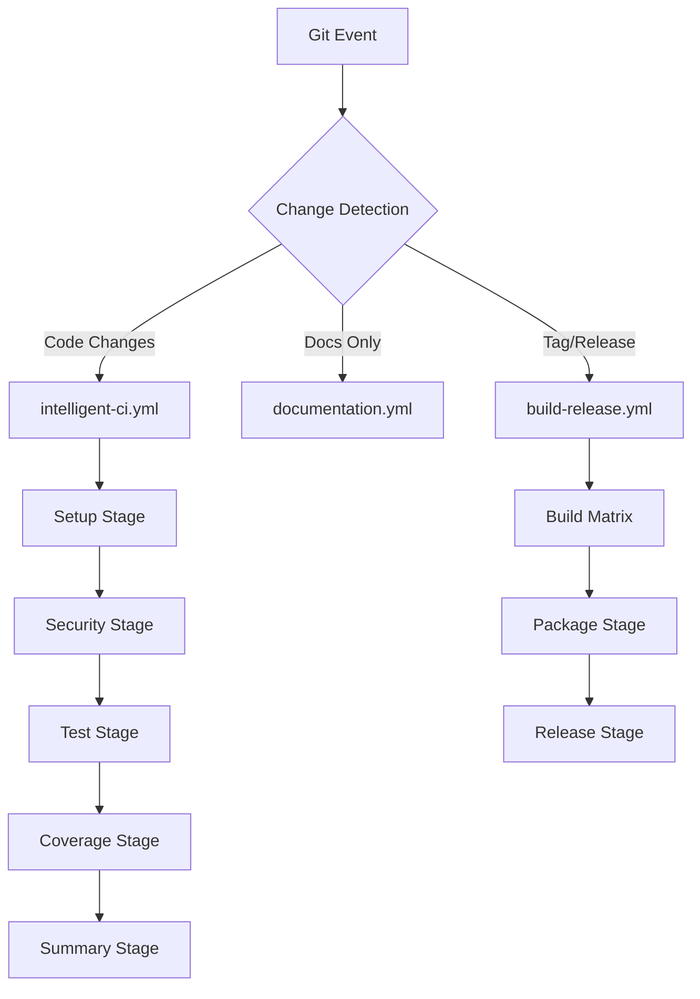

# Phase 3: Technical Design

**Requirement**: CI/CD Workflow Refactor
**Phase**: Technical Design
**Status**: In Progress
**Date**: 2025-06-29

## Architecture Overview

### Unified Pipeline Flow



## Workflow 1: intelligent-ci.yml

### Purpose
Primary CI/CD pipeline with intelligent job execution based on change detection.

### Triggers
```yaml
on:
  push:
    branches: [main, develop]
  pull_request:
    branches: [main, develop]
  workflow_dispatch:
    inputs:
      force_full_run:
        description: 'Force full pipeline execution'
        required: false
        default: 'false'
        type: boolean
```

### Job Architecture

#### Job 1: change-detection
**Purpose**: Analyze changed files and set execution flags
**Runtime**: ~30 seconds
**Dependencies**: None

```yaml
change-detection:
  runs-on: ubuntu-latest
  outputs:
    code-changed: ${{ steps.changes.outputs.code }}
    tests-changed: ${{ steps.changes.outputs.tests }}
    docs-changed: ${{ steps.changes.outputs.docs }}
    config-changed: ${{ steps.changes.outputs.config }}
    security-changed: ${{ steps.changes.outputs.security }}
    force-full: ${{ github.event.inputs.force_full_run == 'true' }}
  
  steps:
    - uses: actions/checkout@v4
    - uses: dorny/paths-filter@v2
      id: changes
      with:
        filters: |
          code:
            - '**/*.ps1'
            - '**/*.psm1'
            - '**/*.psd1'
            - 'aither-core/**'
            - 'Start-AitherZero.ps1'
          tests:
            - 'tests/**'
            - '**/*.Tests.ps1'
          docs:
            - '**/*.md'
            - 'docs/**'
          config:
            - 'configs/**'
            - '.github/workflows/**'
            - '*.json'
          security:
            - 'aither-core/modules/SecureCredentials/**'
            - 'aither-core/modules/RemoteConnection/**'
```

#### Job 2: setup-environment
**Purpose**: Install PowerShell 7 and dependencies
**Runtime**: ~2 minutes
**Dependencies**: change-detection
**Condition**: Code or config changes detected

```yaml
setup-environment:
  needs: change-detection
  if: needs.change-detection.outputs.code-changed == 'true' || needs.change-detection.outputs.config-changed == 'true' || needs.change-detection.outputs.force-full == 'true'
  
  strategy:
    matrix:
      os: [windows-latest, ubuntu-latest, macos-latest]
  
  runs-on: ${{ matrix.os }}
  
  steps:
    - uses: actions/checkout@v4
    
    - name: Install PowerShell 7 (Linux)
      if: runner.os == 'Linux'
      run: |
        wget https://github.com/PowerShell/PowerShell/releases/download/v7.4.1/powershell_7.4.1-1.deb_amd64.deb
        sudo dpkg -i powershell_7.4.1-1.deb_amd64.deb
        sudo apt-get install -f
    
    - name: Install PowerShell 7 (macOS)
      if: runner.os == 'macOS'
      run: |
        brew install powershell
    
    - name: Verify PowerShell Installation
      shell: pwsh
      run: |
        $PSVersionTable
        if ($PSVersionTable.PSVersion.Major -lt 7) {
          throw "PowerShell 7 is required"
        }
    
    - name: Cache PowerShell Modules
      uses: actions/cache@v4
      with:
        path: |
          ~/.local/share/powershell/Modules
          ~/Documents/PowerShell/Modules
        key: ps-modules-${{ runner.os }}-${{ hashFiles('**/*.psd1') }}
```

#### Job 3: security-analysis
**Purpose**: Consolidated security scanning
**Runtime**: ~3 minutes
**Dependencies**: setup-environment
**Condition**: Code or security changes detected

```yaml
security-analysis:
  needs: [change-detection, setup-environment]
  if: needs.change-detection.outputs.code-changed == 'true' || needs.change-detection.outputs.security-changed == 'true' || needs.change-detection.outputs.force-full == 'true'
  
  runs-on: ubuntu-latest
  
  steps:
    - uses: actions/checkout@v4
    
    - name: PowerShell Script Analysis
      shell: pwsh
      run: |
        Install-Module PSScriptAnalyzer -Force -Scope CurrentUser
        $results = Invoke-ScriptAnalyzer -Path . -Recurse -ReportSummary
        
        # Export results for summary
        $results | Export-Clixml -Path "security-analysis-results.xml"
        
        # Fail on high severity issues
        $highSeverity = $results | Where-Object Severity -eq 'Error'
        if ($highSeverity) {
          Write-Error "High severity security issues found: $($highSeverity.Count)"
          exit 1
        }
    
    - name: Dependency Vulnerability Scan
      if: hashFiles('mcp-server/package.json') != ''
      run: |
        cd mcp-server
        npm audit --audit-level=high
    
    - name: Upload Security Results
      uses: actions/upload-artifact@v4
      with:
        name: security-analysis-results
        path: security-analysis-results.xml
```

#### Job 4: cross-platform-tests
**Purpose**: Run tests across all platforms
**Runtime**: ~5 minutes per platform
**Dependencies**: setup-environment
**Condition**: Code or test changes detected

```yaml
cross-platform-tests:
  needs: [change-detection, setup-environment]
  if: needs.change-detection.outputs.code-changed == 'true' || needs.change-detection.outputs.tests-changed == 'true' || needs.change-detection.outputs.force-full == 'true'
  
  strategy:
    matrix:
      os: [windows-latest, ubuntu-latest, macos-latest]
    fail-fast: false
  
  runs-on: ${{ matrix.os }}
  
  steps:
    - uses: actions/checkout@v4
    
    - name: Run Quick Validation
      shell: pwsh
      run: |
        ./tests/Run-BulletproofValidation.ps1 -ValidationLevel Quick -CI
    
    - name: Run Platform-Specific Tests
      shell: pwsh
      run: |
        # Platform-specific test execution
        if ($IsWindows) {
          ./tests/Run-WindowsSpecificTests.ps1
        } elseif ($IsLinux) {
          ./tests/Run-LinuxSpecificTests.ps1
        } elseif ($IsMacOS) {
          ./tests/Run-MacOSSpecificTests.ps1
        }
    
    - name: Upload Test Results
      uses: actions/upload-artifact@v4
      with:
        name: test-results-${{ matrix.os }}
        path: tests/TestResults.xml
```

#### Job 5: code-coverage-analysis
**Purpose**: Unified code coverage across platforms
**Runtime**: ~4 minutes
**Dependencies**: cross-platform-tests
**Condition**: Code changes detected

```yaml
code-coverage-analysis:
  needs: [change-detection, cross-platform-tests]
  if: needs.change-detection.outputs.code-changed == 'true' || needs.change-detection.outputs.force-full == 'true'
  
  runs-on: ubuntu-latest
  
  steps:
    - uses: actions/checkout@v4
    
    - name: Download Test Results
      uses: actions/download-artifact@v4
      with:
        pattern: test-results-*
        merge-multiple: true
    
    - name: Generate Coverage Report
      shell: pwsh
      run: |
        ./tests/Run-CodeCoverage.ps1 -GenerateReport
    
    - name: Upload Coverage to Codecov
      uses: codecov/codecov-action@v4
      with:
        file: ./coverage.xml
        flags: unittests
        name: codecov-umbrella
```

#### Job 6: build-validation
**Purpose**: Quick build validation without full packaging
**Runtime**: ~3 minutes
**Dependencies**: security-analysis
**Condition**: Code changes detected

```yaml
build-validation:
  needs: [change-detection, security-analysis]
  if: needs.change-detection.outputs.code-changed == 'true' || needs.change-detection.outputs.force-full == 'true'
  
  runs-on: ubuntu-latest
  
  steps:
    - uses: actions/checkout@v4
    
    - name: Validate Module Manifests
      shell: pwsh
      run: |
        Get-ChildItem -Path "aither-core/modules" -Filter "*.psd1" -Recurse | ForEach-Object {
          Test-ModuleManifest -Path $_.FullName
        }
    
    - name: Quick Package Test
      shell: pwsh
      run: |
        ./scripts/Test-PackageIntegrity.ps1 -Profile minimal
```

#### Job 7: failure-summary
**Purpose**: Create summary issues for failures
**Runtime**: ~1 minute
**Dependencies**: All previous jobs
**Condition**: Always runs, creates issues on failure

```yaml
failure-summary:
  needs: [change-detection, setup-environment, security-analysis, cross-platform-tests, code-coverage-analysis, build-validation]
  if: always()
  
  runs-on: ubuntu-latest
  
  steps:
    - uses: actions/checkout@v4
    
    - name: Collect Failure Information
      if: contains(needs.*.result, 'failure')
      run: |
        echo "WORKFLOW_FAILED=true" >> $GITHUB_ENV
        
        # Collect failed job details
        echo "FAILED_JOBS<<EOF" >> $GITHUB_ENV
        echo "Setup Environment: ${{ needs.setup-environment.result }}" >> $GITHUB_ENV
        echo "Security Analysis: ${{ needs.security-analysis.result }}" >> $GITHUB_ENV
        echo "Cross-Platform Tests: ${{ needs.cross-platform-tests.result }}" >> $GITHUB_ENV
        echo "Code Coverage: ${{ needs.code-coverage-analysis.result }}" >> $GITHUB_ENV
        echo "Build Validation: ${{ needs.build-validation.result }}" >> $GITHUB_ENV
        echo "EOF" >> $GITHUB_ENV
    
    - name: Create Failure Summary Issue
      if: env.WORKFLOW_FAILED == 'true'
      uses: actions/github-script@v7
      with:
        script: |
          const title = `🚨 CI/CD Pipeline Failure - Run #${context.runNumber}`;
          const body = `
          ## Pipeline Failure Summary
          
          **Workflow**: ${context.workflow}
          **Run Number**: ${context.runNumber}
          **Commit**: ${context.sha.substring(0, 7)}
          **Branch**: ${context.ref}
          **Triggered By**: ${context.actor}
          
          ### Failed Jobs
          \`\`\`
          ${process.env.FAILED_JOBS}
          \`\`\`
          
          ### Quick Actions
          - 🔗 [View Workflow Run](${context.payload.repository.html_url}/actions/runs/${context.runId})
          - 📝 [View Commit](${context.payload.repository.html_url}/commit/${context.sha})
          
          ### Change Detection Results
          - Code Changes: ${{ needs.change-detection.outputs.code-changed }}
          - Test Changes: ${{ needs.change-detection.outputs.tests-changed }}
          - Config Changes: ${{ needs.change-detection.outputs.config-changed }}
          
          ---
          *This issue was automatically created by the CI/CD pipeline.*
          `;
          
          // Check for existing open failure issues
          const existingIssues = await github.rest.issues.listForRepo({
            owner: context.repo.owner,
            repo: context.repo.repo,
            state: 'open',
            labels: 'ci-failure,automated'
          });
          
          if (existingIssues.data.length === 0) {
            // Create new issue
            await github.rest.issues.create({
              owner: context.repo.owner,
              repo: context.repo.repo,
              title: title,
              body: body,
              labels: ['ci-failure', 'automated', 'high-priority']
            });
          } else {
            // Update existing issue
            await github.rest.issues.createComment({
              owner: context.repo.owner,
              repo: context.repo.repo,
              issue_number: existingIssues.data[0].number,
              body: `## New Failure - Run #${context.runNumber}\n\n${body}`
            });
          }
```

## Workflow 2: build-release.yml

### Purpose
Simplified package building and release management with multi-profile support.

### Triggers
```yaml
on:
  push:
    tags:
      - 'v*'
  workflow_dispatch:
    inputs:
      release_type:
        description: 'Release type'
        required: true
        default: 'patch'
        type: choice
        options:
          - patch
          - minor
          - major
      profiles:
        description: 'Build profiles (comma-separated)'
        required: false
        default: 'minimal,standard,full'
```

### Job Architecture

#### Job 1: build-matrix
**Purpose**: Generate build artifacts for all platform/profile combinations
**Runtime**: ~8 minutes per combination
**Strategy**: 9 combinations (3 platforms × 3 profiles)

```yaml
build-matrix:
  strategy:
    matrix:
      os: [windows-latest, ubuntu-latest, macos-latest]
      profile: [minimal, standard, full]
    fail-fast: false
  
  runs-on: ${{ matrix.os }}
  
  steps:
    - uses: actions/checkout@v4
    
    - name: Setup PowerShell 7
      # Same PowerShell 7 installation as intelligent-ci.yml
    
    - name: Build Package
      shell: pwsh
      run: |
        ./scripts/Build-Package.ps1 -Profile ${{ matrix.profile }} -Platform ${{ runner.os }}
    
    - name: Upload Package Artifact
      uses: actions/upload-artifact@v4
      with:
        name: aitherzero-${{ matrix.profile }}-${{ runner.os }}
        path: dist/
```

#### Job 2: create-release
**Purpose**: Create GitHub release with all artifacts
**Runtime**: ~2 minutes
**Dependencies**: build-matrix

```yaml
create-release:
  needs: build-matrix
  runs-on: ubuntu-latest
  
  steps:
    - uses: actions/checkout@v4
    
    - name: Download All Artifacts
      uses: actions/download-artifact@v4
      with:
        pattern: aitherzero-*
        merge-multiple: false
    
    - name: Create Release
      uses: softprops/action-gh-release@v1
      with:
        files: |
          aitherzero-*/
        generate_release_notes: true
        draft: false
        prerelease: false
```

## Workflow 3: documentation.yml

### Purpose
Specialized workflow for documentation generation and repository synchronization.

### Triggers
```yaml
on:
  push:
    branches: [main]
    paths:
      - '**/*.md'
      - 'docs/**'
      - 'aither-core/**/*.ps1'
  schedule:
    - cron: '0 6 * * *'  # Daily at 6 AM UTC
  workflow_dispatch:
```

### Job Architecture

#### Job 1: api-documentation
**Purpose**: Generate PowerShell API documentation
**Runtime**: ~3 minutes

```yaml
api-documentation:
  runs-on: ubuntu-latest
  
  steps:
    - uses: actions/checkout@v4
    
    - name: Generate API Documentation
      shell: pwsh
      run: |
        Install-Module PlatyPS -Force -Scope CurrentUser
        ./scripts/Generate-APIDocs.ps1
    
    - name: Commit Documentation Updates
      uses: stefanzweifel/git-auto-commit-action@v4
      with:
        commit_message: '📚 Update API documentation [skip ci]'
        file_pattern: 'docs/api/**'
```

#### Job 2: sync-repositories
**Purpose**: Synchronize with AitherLabs repository
**Runtime**: ~1 minute

```yaml
sync-repositories:
  runs-on: ubuntu-latest
  
  steps:
    - uses: actions/checkout@v4
      with:
        token: ${{ secrets.SYNC_TOKEN }}
    
    - name: Sync to AitherLabs
      run: |
        # Repository synchronization logic
        ./scripts/Sync-ToAitherLabs.ps1
```

## Performance Projections

### Current State vs Target State

| Metric | Current | Target | Improvement |
|--------|---------|--------|-------------|
| **Jobs per PR** | 15-25 | 5-8 | 70% reduction |
| **Jobs per Main Push** | 30+ | 8-12 | 65% reduction |
| **Workflow Files** | 8 | 3 | 62% reduction |
| **Matrix Combinations** | 6+ | 3 | 50% reduction |
| **Doc-only Change Time** | 8-12 min | 2-3 min | 75% reduction |
| **Full Pipeline Time** | 15-20 min | 12-15 min | 20% reduction |

### Resource Usage Estimates

#### intelligent-ci.yml
- **Full execution**: ~15 minutes, 6 concurrent jobs
- **Code-only changes**: ~12 minutes, 5 concurrent jobs  
- **Test-only changes**: ~8 minutes, 3 concurrent jobs
- **Doc-only changes**: ~2 minutes, 1 job (change detection only)

#### build-release.yml
- **Full matrix**: ~8 minutes, 9 concurrent jobs
- **Single profile**: ~8 minutes, 3 concurrent jobs

#### documentation.yml
- **Full execution**: ~4 minutes, 2 concurrent jobs
- **API docs only**: ~3 minutes, 1 job

## Migration Strategy

### Phase 1: Parallel Testing (Week 1)
1. Create new workflows alongside existing ones
2. Run both systems in parallel
3. Compare results and performance
4. Fine-tune change detection rules

### Phase 2: Gradual Migration (Week 2)
1. Disable most redundant workflows
2. Keep one backup workflow active
3. Monitor new system stability
4. Address any issues

### Phase 3: Full Migration (Week 3)
1. Disable all old workflows
2. Full team adoption
3. Documentation updates
4. Performance monitoring

### Phase 4: Optimization (Week 4)
1. Fine-tune based on real usage
2. Optimize caching strategies
3. Further reduce execution times
4. Add advanced features

## Validation Criteria

### Functional Testing
- [ ] All existing tests pass
- [ ] Security scans produce equivalent results
- [ ] Package builds match current artifacts
- [ ] Cross-platform compatibility maintained

### Performance Testing
- [ ] Job reduction targets met
- [ ] Execution time improvements validated
- [ ] Resource usage reduction confirmed
- [ ] Change detection accuracy verified

### Integration Testing
- [ ] PR workflows function correctly
- [ ] Release workflows create proper artifacts
- [ ] Documentation generation works
- [ ] Issue creation functions properly

## Next Steps

Ready to proceed to **Phase 4: Implementation Planning** with detailed implementation timeline and resource allocation.