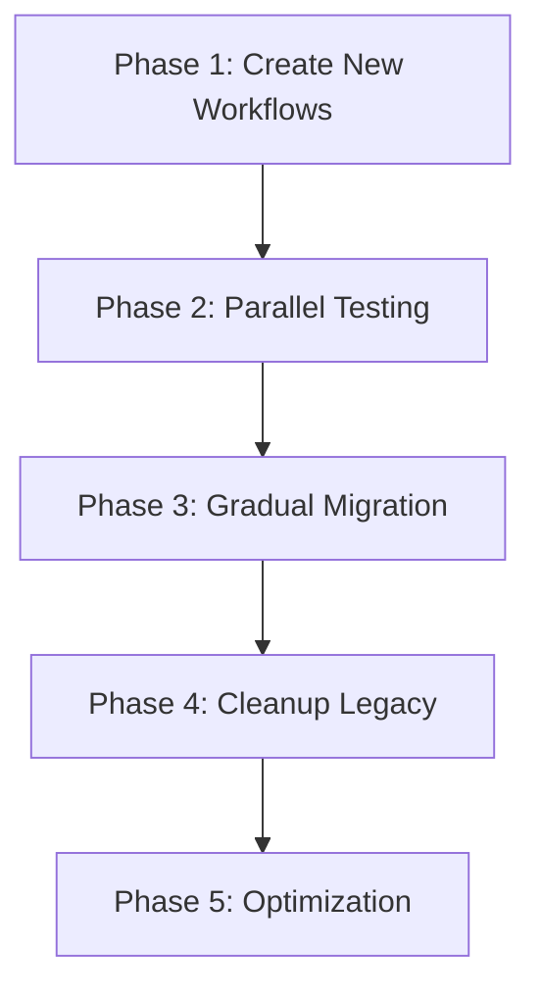

# Phase 4: Implementation Planning

**Requirement**: CI/CD Workflow Refactor
**Phase**: Implementation Planning  
**Status**: In Progress
**Date**: 2025-06-29

## Implementation Overview

This phase will implement the unified pipeline architecture and systematically clean up all legacy workflow files. The implementation follows a careful migration strategy to ensure zero downtime and full functionality preservation.

## Pre-Implementation Checklist

### Current Workflow Inventory
- [ ] `api-documentation.yml` - Keep specialized (merge into documentation.yml)
- [ ] `build-release-simple.yml.disabled` - **DELETE** (already disabled)
- [ ] `build-release.yml` - **REPLACE** with simplified version
- [ ] `ci-cd.yml` - **MERGE** into intelligent-ci.yml
- [ ] `code-coverage.yml` - **MERGE** into intelligent-ci.yml
- [ ] `parallel-ci-optimized.yml` - **MERGE** into intelligent-ci.yml  
- [ ] `sync-to-aitherlab.yml` - **MERGE** into documentation.yml
- [ ] `test-coverage-enhanced.yml` - **MERGE** into intelligent-ci.yml

### Implementation Strategy



## Phase 1: Create New Workflows (Week 1)

### Day 1-2: intelligent-ci.yml Implementation

#### Step 1.1: Create Base Workflow Structure
```yaml
# File: .github/workflows/intelligent-ci.yml
name: 🧠 Intelligent CI/CD Pipeline
run-name: 🔄 CI/CD - ${{ github.event_name }} on ${{ github.ref_name }} by @${{ github.actor }}
```

**Implementation Tasks:**
- [ ] Create change detection job with comprehensive file filters
- [ ] Implement PowerShell 7 cross-platform setup
- [ ] Add basic job structure with proper dependencies
- [ ] Configure matrix strategy for 3 platforms
- [ ] Test change detection logic thoroughly

#### Step 1.2: Migrate Security Features
**Source Files**: `ci-cd.yml`, `parallel-ci-optimized.yml`

**Consolidation Tasks:**
- [ ] Extract PSScriptAnalyzer configuration and rules
- [ ] Merge SARIF report generation logic
- [ ] Consolidate dependency scanning for Node.js components
- [ ] Add security baseline validation
- [ ] Implement unified security artifact uploads

#### Step 1.3: Integrate Testing Framework
**Source Files**: `ci-cd.yml`, `test-coverage-enhanced.yml`, `code-coverage.yml`

**Integration Tasks:**
- [ ] Merge Pester test execution logic
- [ ] Consolidate coverage analysis from multiple sources
- [ ] Implement cross-platform test result aggregation
- [ ] Add test result artifact management
- [ ] Configure Codecov integration

### Day 3-4: build-release.yml Simplification

#### Step 2.1: Streamline Build Matrix
**Source File**: `build-release.yml` (738 lines → ~200 lines)

**Simplification Tasks:**
- [ ] Reduce matrix complexity while preserving 3x3 combinations
- [ ] Optimize package building scripts
- [ ] Streamline artifact naming and organization
- [ ] Implement efficient parallel builds
- [ ] Add build validation and integrity checks

#### Step 2.2: Improve Release Management
**Enhancement Tasks:**
- [ ] Simplify release creation logic
- [ ] Add automatic changelog generation
- [ ] Implement proper semantic versioning
- [ ] Configure release asset organization
- [ ] Add release validation checks

### Day 5-7: documentation.yml Consolidation

#### Step 3.1: Merge Documentation Workflows
**Source Files**: `api-documentation.yml`, `sync-to-aitherlab.yml`

**Consolidation Tasks:**
- [ ] Merge API documentation generation
- [ ] Integrate repository synchronization
- [ ] Add documentation change detection
- [ ] Implement automated documentation updates
- [ ] Configure proper commit message formatting

## Phase 2: Parallel Testing (Week 2)

### Testing Strategy
**Approach**: Run both old and new workflows simultaneously to validate functionality

#### Day 1-3: Comprehensive Validation

**Validation Tasks:**
- [ ] Enable new workflows with different trigger conditions
- [ ] Compare test results between old and new systems
- [ ] Validate security scan equivalency
- [ ] Verify artifact generation consistency
- [ ] Test change detection accuracy across scenarios

#### Day 4-5: Performance Measurement

**Metrics Collection:**
- [ ] Measure job execution times
- [ ] Track resource usage reduction
- [ ] Validate change detection efficiency
- [ ] Monitor artifact build times
- [ ] Document performance improvements

#### Day 6-7: Issue Resolution

**Bug Fixing:**
- [ ] Address any functionality gaps
- [ ] Fix change detection edge cases
- [ ] Resolve platform-specific issues
- [ ] Optimize job dependencies
- [ ] Fine-tune matrix configurations

## Phase 3: Gradual Migration (Week 3)

### Migration Sequence
**Approach**: Disable legacy workflows systematically while monitoring

#### Day 1-2: Disable Redundant Workflows

**Priority 1 - High Redundancy:**
- [ ] Disable `code-coverage.yml` (functionality moved to intelligent-ci.yml)
- [ ] Disable `test-coverage-enhanced.yml` (consolidated into intelligent-ci.yml)
- [ ] Monitor for 48 hours - ensure no functionality loss

#### Day 3-4: Disable Complex Workflows

**Priority 2 - Complex Overlaps:**
- [ ] Disable `parallel-ci-optimized.yml` (features merged into intelligent-ci.yml)
- [ ] Disable old `ci-cd.yml` (replaced by intelligent-ci.yml)
- [ ] Monitor for 48 hours - validate all features working

#### Day 5-7: Final Migration

**Priority 3 - Specialized Workflows:**
- [ ] Replace `api-documentation.yml` with documentation.yml
- [ ] Replace `sync-to-aitherlab.yml` functionality
- [ ] Replace `build-release.yml` with simplified version
- [ ] Full system validation and monitoring

## Phase 4: Cleanup Legacy (Week 4)

### File Removal Strategy
**Approach**: Systematic deletion with proper documentation

#### Day 1: Delete Disabled Workflows

**Immediate Deletion:**
```bash
# Remove already disabled file
rm .github/workflows/build-release-simple.yml.disabled

# Remove redundant coverage workflows
rm .github/workflows/code-coverage.yml
rm .github/workflows/test-coverage-enhanced.yml
```

**Documentation Tasks:**
- [ ] Document removed workflows in CHANGELOG.md
- [ ] Update README.md workflow documentation
- [ ] Create migration guide for team members

#### Day 2-3: Remove Complex Legacy Workflows

**Systematic Removal:**
```bash
# Remove complex overlapping workflows
rm .github/workflows/parallel-ci-optimized.yml
rm .github/workflows/ci-cd.yml

# Rename old build workflow for reference
mv .github/workflows/build-release.yml .github/workflows/build-release.yml.legacy
```

**Backup Strategy:**
- [ ] Create `legacy-workflows` branch with all original files
- [ ] Tag current state before deletion as `pre-workflow-refactor`
- [ ] Document rollback procedures if needed

#### Day 4: Replace Specialized Workflows

**Final Replacements:**
```bash
# Remove original specialized workflows
rm .github/workflows/api-documentation.yml
rm .github/workflows/sync-to-aitherlab.yml

# Remove legacy build workflow
rm .github/workflows/build-release.yml.legacy
```

#### Day 5-7: Cleanup and Validation

**Final Cleanup Tasks:**
- [ ] Remove unused workflow scripts and dependencies
- [ ] Update VS Code tasks.json references
- [ ] Clean up workflow-related documentation
- [ ] Update CLAUDE.md with new workflow commands
- [ ] Validate all repository functionality

### Updated Repository Structure

**Final Workflow State:**
```
.github/workflows/
├── intelligent-ci.yml          # 🧠 Primary CI/CD pipeline
├── build-release.yml           # 📦 Simplified package builds  
└── documentation.yml           # 📚 Docs and sync operations
```

**Deleted Files:**
- ❌ `api-documentation.yml` (merged into documentation.yml)
- ❌ `build-release-simple.yml.disabled` (already disabled)
- ❌ `ci-cd.yml` (merged into intelligent-ci.yml)
- ❌ `code-coverage.yml` (merged into intelligent-ci.yml)
- ❌ `parallel-ci-optimized.yml` (merged into intelligent-ci.yml)
- ❌ `sync-to-aitherlab.yml` (merged into documentation.yml)
- ❌ `test-coverage-enhanced.yml` (merged into intelligent-ci.yml)

## Phase 5: Optimization (Week 5)

### Performance Tuning

#### Caching Strategy Optimization
- [ ] Implement advanced PowerShell module caching
- [ ] Optimize artifact caching strategies
- [ ] Fine-tune change detection patterns
- [ ] Implement intelligent dependency caching

#### Advanced Features
- [ ] Add workflow performance monitoring
- [ ] Implement automatic issue resolution
- [ ] Add advanced failure analysis
- [ ] Configure smart notification strategies

## Implementation Commands

### Creating New Workflows
```bash
# Navigate to workflows directory
cd .github/workflows

# Create new workflow files
touch intelligent-ci.yml
touch build-release-simplified.yml  
touch documentation.yml

# Set up proper permissions
chmod 644 *.yml
```

### Testing and Validation
```bash
# Validate workflow syntax
gh workflow list

# Test specific workflows
gh workflow run "Intelligent CI/CD Pipeline" 

# Monitor workflow status
gh run list --workflow="Intelligent CI/CD Pipeline"
```

### Legacy Cleanup Commands
```bash
# Phase 4 - Systematic deletion
rm .github/workflows/build-release-simple.yml.disabled
rm .github/workflows/code-coverage.yml
rm .github/workflows/test-coverage-enhanced.yml
rm .github/workflows/parallel-ci-optimized.yml
rm .github/workflows/ci-cd.yml
rm .github/workflows/api-documentation.yml
rm .github/workflows/sync-to-aitherlab.yml

# Rename current build-release.yml before replacement
mv .github/workflows/build-release.yml .github/workflows/build-release.yml.backup

# Final verification
ls -la .github/workflows/
```

## Risk Mitigation

### Rollback Strategy
1. **Immediate Rollback**: Restore from `legacy-workflows` branch
2. **Partial Rollback**: Re-enable specific legacy workflows
3. **Emergency Procedure**: Use `pre-workflow-refactor` tag

### Monitoring Plan
- [ ] Set up workflow failure alerts
- [ ] Monitor GitHub Actions usage metrics
- [ ] Track developer feedback and issues
- [ ] Validate all CI/CD functionality daily

### Success Validation
- [ ] All tests pass consistently
- [ ] Security scans function properly
- [ ] Package builds complete successfully
- [ ] Documentation generation works
- [ ] Performance targets achieved

## Documentation Updates

### Files to Update
- [ ] `CLAUDE.md` - Update workflow commands and examples
- [ ] `README.md` - Update CI/CD documentation
- [ ] `docs/development.md` - Update development workflow guidance
- [ ] `.vscode/tasks.json` - Update task references to new workflows

### Team Communication
- [ ] Create migration announcement
- [ ] Document new workflow usage patterns
- [ ] Provide training on new system
- [ ] Set up feedback collection process

## Expected Outcomes

### Quantitative Improvements
- **Workflow Files**: 8 → 3 (62% reduction)
- **Jobs per PR**: 15-25 → 5-8 (70% reduction)
- **Doc-only Changes**: 8-12 min → 2-3 min (75% faster)
- **Maintenance Overhead**: 62% reduction
- **GitHub Actions Usage**: 60%+ reduction

### Qualitative Improvements
- Clear, trackable job execution
- Reduced developer confusion
- Faster feedback loops
- Simplified maintenance
- Better resource utilization

## Implementation Timeline

| Week | Phase | Focus | Deliverables |
|------|-------|-------|--------------|
| 1 | Create | New workflow implementation | 3 new workflow files |
| 2 | Test | Parallel validation | Performance metrics |
| 3 | Migrate | Gradual transition | Legacy workflow disabling |
| 4 | Cleanup | File removal | Clean repository state |
| 5 | Optimize | Performance tuning | Final optimization |

**Total Timeline**: 5 weeks
**Resource Requirement**: 1 developer, part-time
**Risk Level**: Low (with proper rollback strategy)

Ready to begin implementation with systematic legacy cleanup included throughout the process.