# AitherZero Module Dependency Graph

## Module Categories and Dependencies

```mermaid
graph TD
    %% Core Infrastructure (Required)
    Logging[Logging<br/>Core logging system]
    LabRunner[LabRunner<br/>Lab automation]
    OpenTofuProvider[OpenTofuProvider<br/>Infrastructure deployment]
    
    %% Platform Services (Core)
    ModuleComm[ModuleCommunication<br/>Inter-module messaging]
    ConfigCore[ConfigurationCore<br/>Unified configuration]
    
    %% Platform Services
    ConfigCarousel[ConfigurationCarousel<br/>Multi-env config]
    ConfigRepo[ConfigurationRepository<br/>Git-based config]
    OrchEngine[OrchestrationEngine<br/>Workflow execution]
    ParallelExec[ParallelExecution<br/>Parallel tasks]
    ProgressTrack[ProgressTracking<br/>Visual progress]
    
    %% Feature Modules
    ISOManager[ISOManager<br/>ISO management]
    ISOCustomizer[ISOCustomizer<br/>ISO customization]
    SecureCreds[SecureCredentials<br/>Credential management]
    RemoteConn[RemoteConnection<br/>Remote connections]
    SysMonitor[SystemMonitoring<br/>Performance monitoring]
    RestAPI[RestAPIServer<br/>REST API & webhooks]
    
    %% Development Tools
    DevEnv[DevEnvironment<br/>Dev setup]
    PatchMgr[PatchManager<br/>Git workflows]
    TestFramework[TestingFramework<br/>Testing suite]
    AITools[AIToolsIntegration<br/>AI tools]
    
    %% Maintenance & Operations
    BackupMgr[BackupManager<br/>Backup operations]
    UnifiedMaint[UnifiedMaintenance<br/>Maintenance ops]
    ScriptMgr[ScriptManager<br/>Script templates]
    RepoSync[RepoSync<br/>Repo sync]
    SecurityAuto[SecurityAutomation<br/>Security compliance]
    SetupWiz[SetupWizard<br/>Setup wizard]
    
    %% Core Dependencies
    LabRunner --> Logging
    OpenTofuProvider --> Logging
    OpenTofuProvider --> LabRunner
    ModuleComm --> Logging
    ConfigCore --> Logging
    ConfigCore --> ModuleComm
    
    %% Platform Service Dependencies
    ConfigCarousel --> Logging
    ConfigCarousel --> ConfigCore
    ConfigRepo --> Logging
    ConfigRepo --> ConfigCarousel
    OrchEngine --> Logging
    OrchEngine --> LabRunner
    OrchEngine --> ParallelExec
    OrchEngine --> ModuleComm
    ParallelExec --> Logging
    ProgressTrack --> Logging
    
    %% Feature Module Dependencies
    ISOManager --> Logging
    ISOManager --> LabRunner
    ISOCustomizer --> Logging
    ISOCustomizer --> ISOManager
    SecureCreds --> Logging
    RemoteConn --> Logging
    RemoteConn --> SecureCreds
    SysMonitor --> Logging
    RestAPI --> Logging
    RestAPI --> OrchEngine
    
    %% Development Tool Dependencies
    DevEnv --> Logging
    DevEnv --> LabRunner
    PatchMgr --> Logging
    TestFramework --> Logging
    TestFramework --> LabRunner
    AITools --> Logging
    AITools --> DevEnv
    
    %% Maintenance Dependencies
    BackupMgr --> Logging
    UnifiedMaint --> Logging
    UnifiedMaint --> BackupMgr
    ScriptMgr --> Logging
    ScriptMgr --> LabRunner
    RepoSync --> Logging
    SecurityAuto --> Logging
    SecurityAuto --> SecureCreds
    SetupWiz --> Logging
    SetupWiz --> ProgressTrack
    SetupWiz --> AITools
    
    %% Cross-module Integration Points
    OrchEngine -.->|orchestrates| OpenTofuProvider
    RestAPI -.->|exposes API| ConfigCarousel
    RestAPI -.->|uses| ModuleComm
    TestFramework -.->|tests| OpenTofuProvider
    PatchMgr -.->|manages patches| TestFramework
    ConfigCore -.->|notifies via| ModuleComm
    ModuleComm -.->|enables| RestAPI
    
    %% Styling
    classDef core fill:#ff9999,stroke:#333,stroke-width:3px
    classDef platform fill:#99ccff,stroke:#333,stroke-width:2px
    classDef feature fill:#99ff99,stroke:#333,stroke-width:2px
    classDef dev fill:#ffcc99,stroke:#333,stroke-width:2px
    classDef maint fill:#cc99ff,stroke:#333,stroke-width:2px
    
    class Logging,LabRunner,OpenTofuProvider,ModuleComm,ConfigCore core
    class ConfigCarousel,ConfigRepo,OrchEngine,ParallelExec,ProgressTrack platform
    class ISOManager,ISOCustomizer,SecureCreds,RemoteConn,SysMonitor,RestAPI feature
    class DevEnv,PatchMgr,TestFramework,AITools dev
    class BackupMgr,UnifiedMaint,ScriptMgr,RepoSync,SecurityAuto,SetupWiz maint
```

## Module Dependency Matrix

| Module | Direct Dependencies | Used By |
|--------|-------------------|---------|
| **Core Infrastructure** |
| Logging | None | All modules |
| LabRunner | Logging | OrchEngine, DevEnv, ScriptMgr, ISOManager, TestFramework |
| OpenTofuProvider | Logging, LabRunner | OrchEngine, TestFramework |
| **Platform Services** |
| ConfigurationCarousel | Logging | ConfigRepo, RestAPI |
| ConfigurationRepository | Logging, ConfigCarousel | - |
| OrchestrationEngine | Logging, LabRunner, ParallelExec | RestAPI |
| ParallelExecution | Logging | OrchEngine |
| ProgressTracking | Logging | SetupWizard |
| **Feature Modules** |
| ISOManager | Logging, LabRunner | ISOCustomizer |
| ISOCustomizer | Logging, ISOManager | - |
| SecureCredentials | Logging | RemoteConnection, SecurityAutomation |
| RemoteConnection | Logging, SecureCredentials | - |
| SystemMonitoring | Logging | - |
| RestAPIServer | Logging, OrchEngine | - |
| **Development Tools** |
| DevEnvironment | Logging, LabRunner | AITools |
| PatchManager | Logging | - |
| TestingFramework | Logging, LabRunner | - |
| AIToolsIntegration | Logging, DevEnvironment | SetupWizard |
| **Maintenance & Operations** |
| BackupManager | Logging | UnifiedMaintenance |
| UnifiedMaintenance | Logging, BackupManager | - |
| ScriptManager | Logging, LabRunner | - |
| RepoSync | Logging | - |
| SecurityAutomation | Logging, SecureCredentials | - |
| SetupWizard | Logging, ProgressTracking, AITools | - |

## Key Integration Patterns

### 1. **Logging Hub**
- All modules depend on Logging for centralized output
- Provides consistent logging across the platform

### 2. **LabRunner as Core Engine**
- Central execution engine for automation tasks
- Used by OrchestrationEngine, DevEnvironment, and testing

### 3. **Configuration Management Chain**
- ConfigurationCarousel → ConfigurationRepository
- Enables multi-environment configuration with Git backing

### 4. **Orchestration Stack**
- OrchestrationEngine uses LabRunner + ParallelExecution
- RestAPIServer exposes orchestration via API

### 5. **ISO Management Pipeline**
- ISOManager → ISOCustomizer
- Complete ISO lifecycle management

### 6. **Security Layer**
- SecureCredentials → RemoteConnection, SecurityAutomation
- Centralized credential management

### 7. **Development Workflow**
- PatchManager + TestingFramework
- DevEnvironment + AIToolsIntegration

### 8. **Setup & Onboarding**
- SetupWizard uses ProgressTracking + AITools
- Intelligent first-time setup experience

## Module Load Order

Based on dependencies, modules should be loaded in this order:

1. **Foundation**: Logging
2. **Core Services**: LabRunner, ParallelExecution
3. **Infrastructure**: OpenTofuProvider
4. **Configuration**: ConfigurationCarousel, ConfigurationRepository
5. **Platform**: OrchestrationEngine, ProgressTracking
6. **Features**: ISOManager, SecureCredentials, SystemMonitoring
7. **Extended Features**: ISOCustomizer, RemoteConnection, RestAPIServer
8. **Development**: DevEnvironment, PatchManager, TestingFramework
9. **Advanced Dev**: AIToolsIntegration
10. **Operations**: BackupManager, ScriptManager, RepoSync, SecurityAutomation
11. **Maintenance**: UnifiedMaintenance
12. **Setup**: SetupWizard

## Circular Dependencies

Currently, there are no circular dependencies in the module architecture. This is maintained by:
- Clear separation of concerns
- Unidirectional dependency flow
- Core modules having no dependencies
- Feature modules depending only on core/platform modules