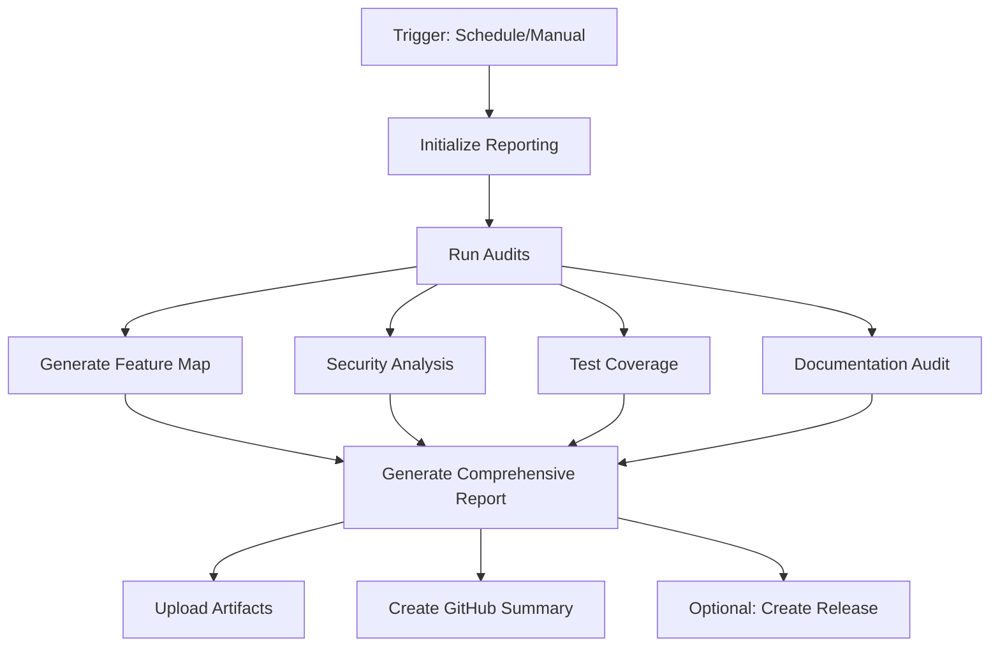

# AitherZero Comprehensive Reporting System

The AitherZero Comprehensive Reporting System provides automated auditing, analysis, and HTML report generation
for the entire AitherZero project. This system delivers the visibility and control needed for confident
releases and development.

## 🎯 Overview

This reporting system combines multiple audit sources into unified, actionable reports:

- **📝 Documentation Auditing** - README.md coverage and staleness analysis
- **🧪 Test Coverage Analysis** - Module test coverage and quality metrics
- **🔒 Security Scanning** - Security compliance and vulnerability detection
- **🔧 Code Quality Analysis** - PSScriptAnalyzer results and remediation
- **🗺️ Dynamic Feature Mapping** - Module capabilities and dependency relationships
- **📦 Build & Deployment Status** - Cross-platform build validation
- **📊 Comprehensive HTML Dashboard** - Interactive reports with actionable insights

## 🚀 Quick Start

### Generate Comprehensive Report

```powershell
# Generate full comprehensive report
./scripts/reporting/Generate-ComprehensiveReport.ps1

# Generate with detailed analysis
./scripts/reporting/Generate-ComprehensiveReport.ps1 -IncludeDetailedAnalysis

# Custom report title and version
./scripts/reporting/Generate-ComprehensiveReport.ps1 -ReportTitle "AitherZero Release Candidate" -Version "0.8.0-rc1"
```

### Generate Dynamic Feature Map

```powershell
# Generate feature map with HTML visualization
./scripts/reporting/Generate-DynamicFeatureMap.ps1 -HtmlOutput -IncludeDependencyGraph

# Analyze module integrations
./scripts/reporting/Generate-DynamicFeatureMap.ps1 -AnalyzeIntegrations -VerboseOutput
```

### Automated CI/CD Reports

The comprehensive reporting workflow runs automatically:

- **Daily at 6 AM UTC** - Full comprehensive report
- **On workflow dispatch** - Manual triggering with options
- **On release preparation** - Version-specific testing and validation

## 📊 Report Types

### 1. Comprehensive Report (`comprehensive-report.html`)

**The main deliverable** - a complete HTML dashboard featuring:

- 🎯 **Executive Summary** - Overall health grade and key metrics
- 📈 **Trend Analysis** - Improvements over time
- 🧪 **Test Coverage Matrix** - Module-by-module test status
- 🔒 **Security & Compliance Status** - Security scan results
- 📝 **Documentation Health** - README coverage by directory
- 🔧 **Code Quality Metrics** - PSScriptAnalyzer findings
- 🗺️ **Dynamic Feature Map** - Interactive module visualization
- 📦 **Build Status** - Cross-platform deployment readiness
- 📋 **Action Items** - Prioritized remediation plan

### 2. Dynamic Feature Map (`feature-map.json` & `feature-map.html`)

**Module analysis and visualization** including:

- **Module Discovery** - All 30+ modules with metadata
- **Capability Analysis** - Function exports and features
- **Dependency Mapping** - Module relationships and requirements
- **Health Assessment** - Module-specific health scores
- **Category Classification** - Organized by type (Managers, Providers, Core, etc.)

### 3. Audit Results (Individual JSON/HTML files)

**Detailed findings** from each audit system:

- `documentation-audit-reports/` - Documentation analysis
- `testing-audit-reports/` - Test coverage details
- `security-scan-results/` - Security findings
- `quality-analysis-results.json` - Code quality analysis

## 🔧 Configuration

### Report Generation Parameters

```powershell
# Comprehensive Report Generator
./scripts/reporting/Generate-ComprehensiveReport.ps1 `
    -ReportPath "./reports/my-report.html" `
    -ArtifactsPath "./my-audit-data" `
    -IncludeDetailedAnalysis `
    -ReportTitle "Custom Report Title" `
    -Version "1.0.0" `
    -VerboseOutput

# Feature Map Generator  
./scripts/reporting/Generate-DynamicFeatureMap.ps1 `
    -OutputPath "./reports/features.json" `
    -HtmlOutput `
    -IncludeDependencyGraph `
    -ModulesPath "./custom-modules" `
    -AnalyzeIntegrations `
    -VerboseOutput
```

### CI/CD Workflow Options

```yaml
# Manual workflow dispatch options
workflow_dispatch:
  inputs:
    report_type:
      # comprehensive, health-check, feature-map, version-test
    version_test:
      # Version to test (for version-test type)
    include_detailed_analysis:
      # Include drill-down analysis
    generate_html:
      # Generate HTML reports
    create_github_release:
      # Create GitHub release (for version-test)
```

## 📈 Health Scoring

The system calculates weighted health scores across multiple factors:

### Health Factors & Weights

| Factor | Weight | Description |
|--------|--------|-------------|
| **Test Coverage** | 30% | Module test coverage and quality |
| **Security Compliance** | 25% | Security scan results and compliance |
| **Code Quality** | 20% | PSScriptAnalyzer findings and standards |
| **Documentation Coverage** | 15% | README.md and documentation presence |
| **Module Health** | 10% | Module loading and basic functionality |

### Grade Scale

- **A** (90-100%) - Excellent health, production ready
- **B** (80-89%) - Good health, minor improvements needed
- **C** (70-79%) - Fair health, moderate attention required
- **D** (60-69%) - Poor health, significant improvements needed
- **F** (<60%) - Critical health, immediate attention required

## 🎯 Workflow Integration

### GitHub Actions Workflows

#### 1. Comprehensive Report Workflow (`.github/workflows/comprehensive-report.yml`)

**Primary automation** for report generation:

- **Triggers**: Daily schedule, manual dispatch, version testing
- **Outputs**: HTML reports, JSON data, GitHub artifacts
- **Duration**: ~10-15 minutes for full comprehensive report
- **Artifacts**: 90-day retention for reports, 30-day for audit data

#### 2. Existing Audit Workflows (Enhanced)

The system builds on existing workflows:

- `audit.yml` - Documentation, testing, duplicate detection
- `security-scan.yml` - Security scanning with multiple tools
- `code-quality-remediation.yml` - PSScriptAnalyzer with automated fixes

### Artifact Management

Reports are automatically uploaded as GitHub artifacts:

```yaml
# Download comprehensive report
artifacts:
  - name: comprehensive-report
    files: [aitherZero-comprehensive-report.html, report-summary.json]
    retention: 90 days
    
  - name: feature-map  
    files: [feature-map.json, feature-map.html]
    retention: 90 days
    
  - name: audit-results
    files: [audit-reports/**/*]
    retention: 30 days
```

## 🔍 Usage Examples

### Development Workflow

```powershell
# 1. Generate feature map to understand current state
./scripts/reporting/Generate-DynamicFeatureMap.ps1 -HtmlOutput

# 2. Run comprehensive analysis before major changes
./scripts/reporting/Generate-ComprehensiveReport.ps1 -IncludeDetailedAnalysis

# 3. Review HTML reports for action items
# Open: comprehensive-report.html and feature-map.html
```

### Release Preparation

```powershell
# 1. Run version-specific testing
# Trigger: comprehensive-report workflow with version-test type

# 2. Generate release-ready report
./scripts/reporting/Generate-ComprehensiveReport.ps1 `
    -ReportTitle "AitherZero v0.8.0 Release Validation" `
    -Version "0.8.0" `
    -IncludeDetailedAnalysis

# 3. Review health score and address critical issues
# Health Score must be B+ (80%+) for release approval
```

### Continuous Monitoring

```powershell
# Daily automated comprehensive reports provide:
# - Health trend monitoring
# - Early issue detection
# - Progress tracking
# - Automated issue creation for critical findings
```

## 🛠️ Architecture

### Report Generation Pipeline



### Data Sources

- **Module Manifests** (`.psd1`) - Version, dependencies, exports
- **Module Scripts** (`.psm1`) - Function analysis, complexity
- **Test Files** (`*.Tests.ps1`) - Coverage and quality metrics
- **Documentation** (`README.md`) - Coverage analysis
- **Audit Artifacts** (JSON) - Previous audit results
- **Git History** - Change tracking and trends

### Output Formats

- **HTML Reports** - Interactive dashboards with charts and drill-downs
- **JSON Data** - Machine-readable results for automation
- **GitHub Artifacts** - Downloadable reports with retention policies
- **GitHub Summaries** - Workflow-integrated status updates

## 📋 Troubleshooting

### Common Issues

#### 1. Missing Audit Data

**Problem**: Report shows "No data" for certain sections

**Solution**:
```powershell
# Ensure audit artifacts exist
ls ./audit-reports/

# Run individual audit scripts
./scripts/testing/Audit-TestCoverage.ps1 -GenerateHTML
./scripts/documentation/Analyze-ContentDeltas.ps1 -ExportChanges
```

#### 2. Module Analysis Failures

**Problem**: Some modules not appearing in feature map

**Solution**:
```powershell
# Check module manifests
Get-ChildItem ./aither-core/modules -Recurse -Filter "*.psd1" | ForEach-Object {
    try {
        Import-PowerShellDataFile $_.FullName | Out-Null
        Write-Host "✅ $($_.Name)" -ForegroundColor Green
    } catch {
        Write-Host "❌ $($_.Name): $($_.Exception.Message)" -ForegroundColor Red
    }
}
```

#### 3. HTML Report Generation Errors

**Problem**: HTML report fails to generate

**Solution**:
```powershell
# Run with verbose output for debugging
./scripts/reporting/Generate-ComprehensiveReport.ps1 -VerboseOutput

# Check PowerShell version (7.0+ required)
$PSVersionTable.PSVersion

# Verify project root detection
. "./aither-core/shared/Find-ProjectRoot.ps1"
Find-ProjectRoot
```

#### 4. Workflow Permissions

**Problem**: GitHub Actions workflow fails with permissions

**Solution**:
- Ensure `contents: write` permission for release creation
- Check `GITHUB_TOKEN` scope in repository settings
- Verify artifact upload permissions

### Performance Optimization

```powershell
# For large codebases, use targeted analysis
./scripts/reporting/Generate-DynamicFeatureMap.ps1 -ModulesPath "./specific-modules"

# Skip expensive operations for quick reports
./scripts/reporting/Generate-ComprehensiveReport.ps1 # Basic analysis only

# Use caching for repeated analysis
# Audit artifacts are cached for 24 hours by default
```

## 🔗 Integration Points

### PatchManager Integration

```powershell
# Generate reports before major changes
New-Feature -Description "Add comprehensive reporting" -Changes {
    # Generate baseline report
    ./scripts/reporting/Generate-ComprehensiveReport.ps1 -ReportTitle "Pre-Change Baseline"
    
    # Make changes...
    
    # Generate post-change report
    ./scripts/reporting/Generate-ComprehensiveReport.ps1 -ReportTitle "Post-Change Validation"
}
```

### VS Code Integration

```json
// .vscode/tasks.json
{
    "label": "Generate Comprehensive Report",
    "type": "shell", 
    "command": "./scripts/reporting/Generate-ComprehensiveReport.ps1",
    "args": ["-VerboseOutput"],
    "group": "build",
    "presentation": {
        "echo": true,
        "reveal": "always"
    }
}
```

### External Tool Integration

```powershell
# Export data for external tools
$featureMap = Get-Content "./feature-map.json" | ConvertFrom-Json
$healthScore = $featureMap.Statistics

# Integration with monitoring systems
$healthData = @{
    timestamp = Get-Date
    version = "0.8.0"
    healthScore = $healthScore.OverallScore
    testCoverage = $healthScore.TestCoveragePercentage
}

# Send to monitoring endpoint
Invoke-RestMethod -Uri "https://monitoring.example.com/api/health" -Method POST -Body ($healthData | ConvertTo-Json)
```

## 📚 Advanced Features

### Custom Health Scoring

```powershell
# Override health factor weights
$customWeights = @{
    TestCoverage = 0.4        # Increase test importance
    SecurityCompliance = 0.3   # Increase security importance  
    CodeQuality = 0.15
    DocumentationCoverage = 0.1
    ModuleHealth = 0.05
}

# Apply custom scoring (requires script modification)
```

### Trend Analysis

```powershell
# Historical health tracking
$previousReports = Get-ChildItem "./reports" -Filter "*-report-summary.json"
$trends = $previousReports | ForEach-Object {
    $data = Get-Content $_.FullName | ConvertFrom-Json
    @{
        Date = $data.timestamp
        HealthScore = $data.healthScore
        TestCoverage = $data.testCoverage
    }
}

# Analyze trends over time
$trends | Sort-Object Date | Format-Table
```

### Custom Report Templates

```powershell
# Create custom report sections
$customSections = @(
    @{
        Title = "Custom Analysis"
        Content = "Custom HTML content here"
        Priority = "High"
    }
)

# Include in comprehensive report (requires script modification)
```

## 🎉 Success Metrics

After implementing the comprehensive reporting system:

### Immediate Benefits
- ✅ **Complete Visibility** - Single HTML report with all audit data
- ✅ **Actionable Intelligence** - Prioritized remediation recommendations
- ✅ **Automated Workflow** - No manual intervention required
- ✅ **Professional Presentation** - Stakeholder-ready reports

### Long-term Value
- 📈 **Quality Improvement** - Measurable health score progression
- 🚀 **Faster Releases** - Confident release decisions with data
- 🔧 **Efficient Development** - Clear action items and priorities
- 📊 **Trend Analysis** - Historical health and improvement tracking

---

## 🤖 Generated Documentation

This comprehensive reporting system was designed and implemented by Claude Code to provide AitherZero with enterprise-grade auditing and reporting capabilities.

**System Version**: 1.0  
**Last Updated**: 2024  
**Compatibility**: PowerShell 7.0+, Cross-platform  
**Dependencies**: AitherZero core modules, GitHub Actions  

For issues or enhancements, please create issues in the AitherZero repository with the `reporting` label.