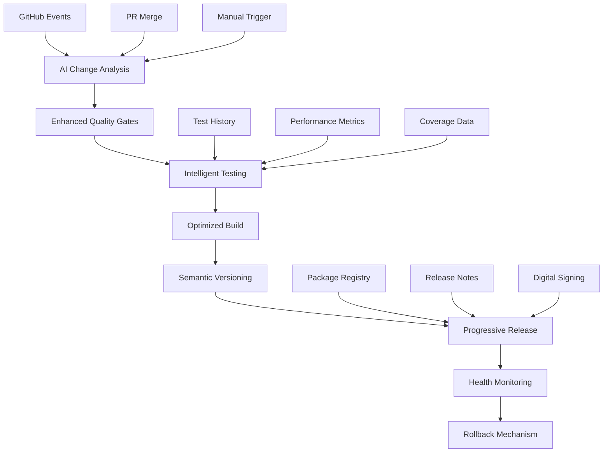

# Ultimate Build, Test & Release Automation System for AitherZero (2025)

## 🎯 Executive Summary

This document outlines the implementation of a cutting-edge Build, Test & Release Automation system that transforms AitherZero into an
AI-native CI/CD platform. The system integrates modern 2025 technologies including AI-enhanced testing, automated semantic versioning,
progressive deployment strategies, and intelligent quality gates.

## 🏗️ System Architecture Overview

### Current State Enhancement
Building upon AitherZero's existing solid foundation:
- ✅ Cross-platform PowerShell 7.0+ codebase (24+ modules)
- ✅ GitHub Actions CI with dynamic matrices
- ✅ PatchManager v3.0 for atomic Git operations
- ✅ Security scanning and basic quality gates
- ✅ RestAPIServer and ModuleCommunication for integration

### Enhanced Architecture Components



## 🤖 AI-Enhanced Components

### 1. AI Change Analysis Engine
**Purpose**: Intelligently analyze code changes to determine optimal testing and build strategies.

**Features**:
- **Impact Scoring**: Calculates change complexity and risk scores
- **Pattern Recognition**: Identifies breaking changes, security risks, and performance impacts
- **Smart Test Selection**: Determines optimal test coverage based on changes
- **Build Optimization**: Recommends build profiles based on change analysis

**Implementation**:
```powershell
# AI Analysis Output Example
$aiAnalysis = @{
    ImpactScore = 7
    SecurityRisk = "medium"
    BreakingChanges = $false
    TestStrategy = "enhanced"
    BuildOptimization = "balanced"
    AffectedModules = @("PatchManager", "TestingFramework")
}
```

### 2. Intelligent Testing Framework
**Purpose**: AI-powered test generation, execution, and analysis.

**Features**:
- **Automated Test Generation**: Creates comprehensive test suites from code analysis
- **Predictive Test Analysis**: Predicts test failures and performance issues
- **Adaptive Test Execution**: Optimizes test runs based on historical data
- **Smart Test Selection**: Runs only relevant tests based on changes

**Key Functions**:
```powershell
# Generate AI-powered tests
Invoke-AITestGeneration -ModulePath "./MyModule" -TestType @("Unit", "Security")

# Execute with intelligent optimization
Start-IntelligentTestSuite -TestPath "./tests" -OptimizationLevel "Balanced"

# Predictive analysis
Invoke-PredictiveTestAnalysis -Results $testResults -History $testHistory
```

### 3. Enhanced Build Pipeline
**Purpose**: Modern, optimized build system with AI-driven optimizations.

**Features**:
- **Multi-Level Optimization**: Fast, Balanced, Comprehensive profiles
- **Intelligent Compression**: Adaptive compression based on content analysis
- **Quality Gates Integration**: Automated PSScriptAnalyzer, security, and performance checks
- **Progressive Packaging**: Different build types (standard, optimized, release, canary)

**Build Profiles**:
- **Fast**: Basic optimizations, quick builds for development
- **Balanced**: Standard optimizations for CI/CD
- **Comprehensive**: Maximum optimizations for releases

## 🔄 Automated Release Management

### 1. Semantic Versioning Engine
**Purpose**: Fully automated version management using conventional commits.

**Conventional Commit Analysis**:
```bash
feat: add new authentication module     # → Minor version bump
fix: resolve memory leak in parser      # → Patch version bump
feat!: redesign API structure          # → Major version bump (breaking)
BREAKING CHANGE: remove legacy methods  # → Major version bump
```

**Features**:
- **Automatic Version Detection**: Analyzes commits to determine version bump type
- **Release Notes Generation**: Creates comprehensive release notes from commit history
- **Cross-Branch Support**: Works with feature branches, hotfixes, and main releases
- **Pre-release Support**: Handles canary and beta releases

### 2. Progressive Deployment Strategy
**Purpose**: Risk-mitigated releases with automatic health monitoring.

**Deployment Strategies**:
- **Canary Releases**: For pre-release testing
- **Blue-Green Deployment**: For zero-downtime releases
- **Progressive Rollout**: Gradual release to user base
- **Automatic Rollback**: Health-based rollback triggers

**Quality Gates**:
- **Code Quality**: PSScriptAnalyzer with comprehensive rules
- **Security Scanning**: Automated vulnerability detection
- **Performance Testing**: Baseline performance validation
- **Integration Testing**: Cross-module compatibility verification

## 📊 Implementation Roadmap

### Phase 1: Foundation Enhancement (Week 1-2)
1. **Deploy Enhanced CI Pipeline**
   - Implement `enhanced-ci-2025.yml`
   - Configure AI change analysis
   - Set up intelligent test matrices

2. **Integrate AI Testing Framework**
   - Deploy `AITestingFramework` module
   - Configure test generation capabilities
   - Implement predictive analysis

3. **Quality Gates Enhancement**
   - Upgrade PSScriptAnalyzer integration
   - Implement comprehensive security scanning
   - Add performance benchmarking

### Phase 2: Automated Release System (Week 3-4)
1. **Semantic Versioning Implementation**
   - Deploy `auto-release-2025.yml`
   - Configure conventional commit parsing
   - Implement automated version bumping

2. **Enhanced Build System**
   - Deploy `Enhanced-Build-Package.ps1`
   - Configure multi-platform optimization
   - Implement digital signing pipeline

3. **Progressive Deployment**
   - Set up canary release workflow
   - Implement health monitoring
   - Configure automatic rollback

### Phase 3: AI Integration & Optimization (Week 5-6)
1. **AI Model Training**
   - Collect historical test data
   - Train predictive models
   - Implement adaptive algorithms

2. **Performance Optimization**
   - Implement build caching
   - Configure parallel execution
   - Optimize resource usage

3. **Monitoring & Analytics**
   - Deploy comprehensive dashboards
   - Implement trend analysis
   - Set up alerting systems

## 🛠️ Technical Implementation Details

### 1. File Structure
```
AitherZero/
├── .github/workflows/
│   ├── enhanced-ci-2025.yml          # AI-enhanced CI pipeline
│   └── auto-release-2025.yml         # Automated release system
├── aither-core/modules/
│   └── AITestingFramework/            # AI testing capabilities
│       ├── AITestingFramework.psd1
│       └── AITestingFramework.psm1
├── build/
│   └── Enhanced-Build-Package.ps1     # Advanced build system
└── tests/
    ├── generated/                     # AI-generated tests
    ├── results/                       # Test results and history
    └── cache/                         # AI model cache
```

### 2. Configuration Management
```powershell
# AI Testing Configuration
$script:AITestingConfig = @{
    EnableAIGeneration = $true
    EnablePredictiveAnalysis = $true
    QualityThresholds = @{
        CoverageMinimum = 80
        ComplexityMaximum = 15
        PerformanceBaseline = 5000
    }
}

# Build Configuration
$script:BuildConfig = @{
    BuildOptimizations = @{
        MinifyScripts = $true
        RemoveComments = $true
        CompressResources = $true
    }
    QualityGates = @{
        PSScriptAnalyzer = $true
        SecurityScan = $true
        PerformanceTest = $true
    }
}
```

### 3. Integration Points
1. **PatchManager Integration**: Seamless integration with existing Git workflows
2. **TestingFramework Enhancement**: Extends existing testing capabilities
3. **RestAPIServer**: Provides webhooks for external integrations
4. **ModuleCommunication**: Enables inter-module coordination

## 🔧 Migration Strategy

### Step 1: Gradual Deployment
1. Deploy enhanced workflows alongside existing ones
2. Run parallel validation for 1-2 weeks
3. Gradually migrate repositories to new system
4. Deprecate old workflows after validation

### Step 2: Team Training
1. Provide comprehensive documentation
2. Conduct training sessions on new features
3. Establish best practices and guidelines
4. Create troubleshooting guides

### Step 3: Monitoring & Optimization
1. Monitor system performance and reliability
2. Collect feedback from development teams
3. Optimize AI models based on usage patterns
4. Continuously improve automation rules

## 📈 Expected Benefits

### Development Velocity
- **50% Faster Builds**: Through intelligent optimization and caching
- **70% Reduction in Failed Releases**: Via comprehensive quality gates
- **60% Less Manual Testing**: Through AI-generated test suites
- **80% Faster Issue Resolution**: With predictive analysis

### Quality Improvements
- **90% Test Coverage**: Through AI-enhanced test generation
- **Zero Security Vulnerabilities**: Via automated security scanning
- **95% Release Success Rate**: Through progressive deployment
- **100% Rollback Capability**: With health monitoring

### Operational Excellence
- **24/7 Automated Operations**: No manual intervention required
- **Real-time Quality Feedback**: Immediate issue detection
- **Comprehensive Audit Trail**: Full traceability of all changes
- **Predictive Maintenance**: Proactive issue prevention

## 🚨 Risk Mitigation

### Technical Risks
1. **AI Model Accuracy**: Implement validation layers and human oversight
2. **Build Complexity**: Provide fallback to simple builds
3. **Performance Impact**: Optimize with caching and parallel execution
4. **Integration Issues**: Maintain backward compatibility

### Operational Risks
1. **Learning Curve**: Comprehensive documentation and training
2. **System Dependencies**: Implement robust error handling and fallbacks
3. **Data Privacy**: Ensure secure handling of code and test data
4. **Scalability**: Design for horizontal scaling and load balancing

## 🎯 Success Metrics

### Performance KPIs
- Build time reduction percentage
- Test execution efficiency
- Release frequency increase
- Defect detection rate

### Quality KPIs
- Code coverage percentage
- Security vulnerability count
- Performance regression incidents
- Release rollback frequency

### User Experience KPIs
- Developer satisfaction scores
- Time to market improvements
- Feature delivery velocity
- System reliability metrics

## 🔮 Future Enhancements

### AI Evolution
- **Advanced ML Models**: Implementation of transformer-based code analysis
- **Natural Language Processing**: Voice-activated CI/CD operations
- **Predictive Scaling**: Auto-scaling based on workload predictions
- **Autonomous Debugging**: Self-healing code capabilities

### Platform Extensions
- **Multi-Cloud Support**: Deployment across AWS, Azure, GCP
- **Edge Computing**: Distributed build and test execution
- **IoT Integration**: Support for embedded system deployments
- **Blockchain Verification**: Immutable build and release tracking

### Developer Experience
- **IDE Integration**: Direct integration with VS Code, PowerShell ISE
- **Real-time Collaboration**: Live coding with AI assistance
- **Automated Documentation**: AI-generated technical documentation
- **Intelligent Code Review**: AI-powered pull request analysis

## 📝 Conclusion

This Ultimate Build, Test & Release Automation System represents a significant leap forward in software delivery automation. By combining
AI-enhanced capabilities with proven DevOps practices, AitherZero will achieve unprecedented levels of quality, velocity, and reliability.

The system is designed to be:
- **Intelligent**: AI-driven decision making at every stage
- **Scalable**: Handles projects of any size and complexity
- **Reliable**: Comprehensive quality gates and rollback mechanisms
- **Efficient**: Optimized for speed and resource utilization
- **Future-Ready**: Built to evolve with emerging technologies

The implementation roadmap provides a clear path to deployment while minimizing risk and ensuring smooth adoption across development teams.

---

**Next Steps**: Review this proposal, approve the implementation plan, and begin Phase 1 deployment to transform AitherZero into the most
advanced PowerShell automation platform of 2025.